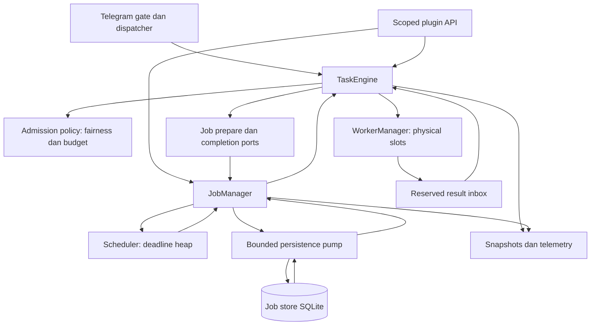
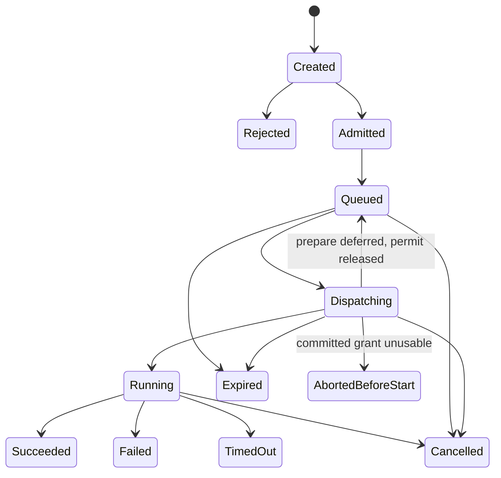
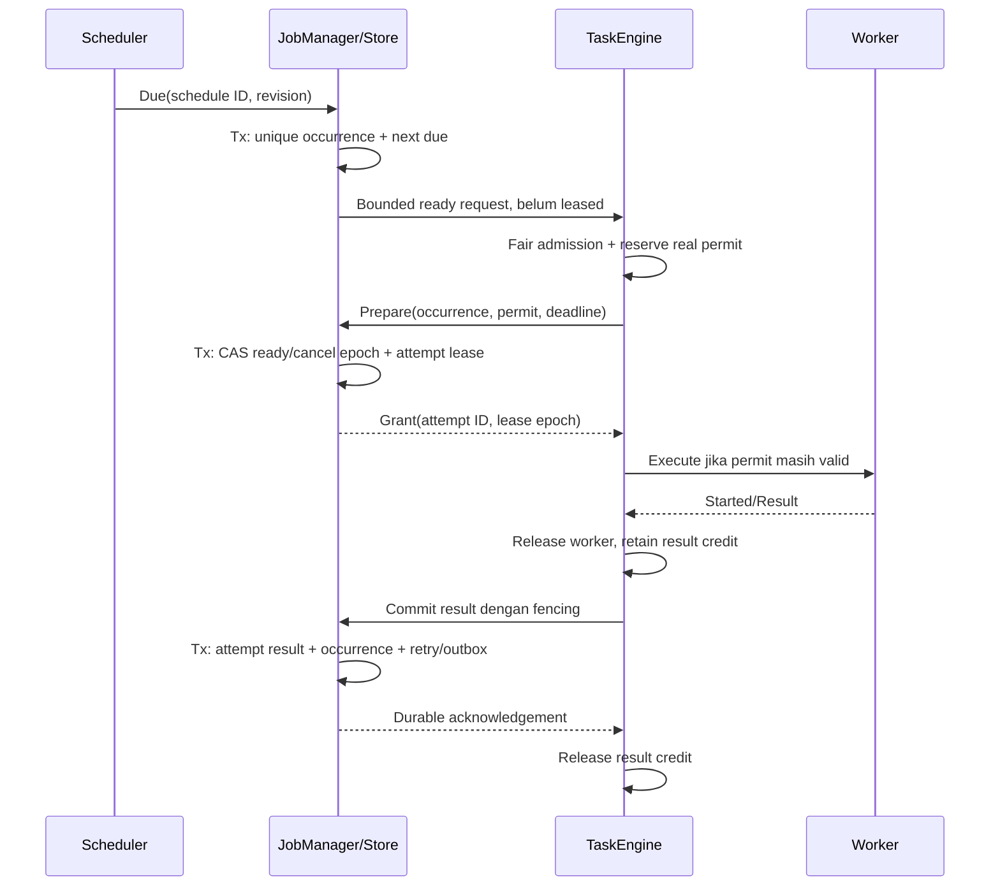
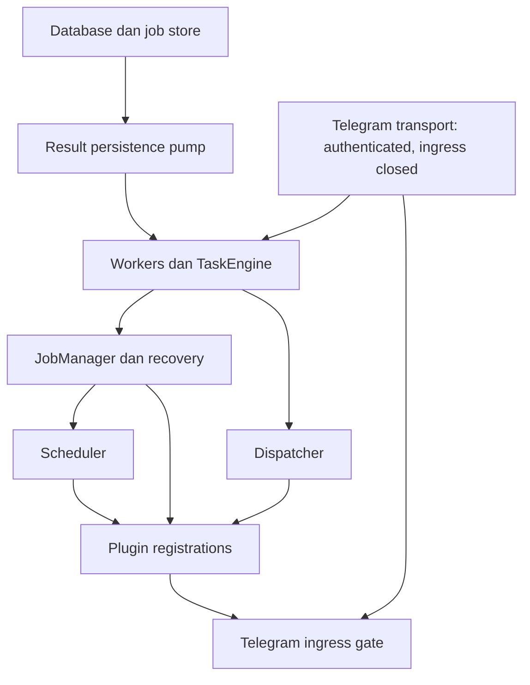

# ADR 0006: Redesign execution runtime dari prinsip dasar

- Status: **Proposed — belum diimplementasikan atau diterima sebagai pengganti ADR lama**.
- Tanggal: 14 September 2026.
- Baseline: `fix/execution-admission-periodic`, awalnya HEAD `03ed71c` beserta patch perbaikan lokal, kemudian tercatat sebagai `bfe7f0d` saat finalisasi; lihat [analisa teknikal](../design/execution-redesign/01-technical-analysis.md).
- Rencana penerapan: [implementation plan](../design/execution-redesign/03-implementation-plan.md).
- Jika diterima: menggantikan semantics execution ADR 0003 serta merinci lifecycle ADR 0001 dan scope ADR 0002 pada area terkait. ADR 0004/0005 tetap berlaku.

## 1. Tujuan dan arti “dari nol”

Desain diturunkan dari invariant, kemudian dipetakan ke kode. API/struct/algoritma lama tidak dianggap constraint internal. Constraint eksternal yang dipertahankan adalah perilaku command, permission, ownership plugin, data existing, recovery yang dapat diaudit, dan kemampuan rollback.

Hasil yang ditargetkan:

1. Setiap mutable state mempunyai satu penulis yang dapat disebutkan.
2. Semua finite feature execution memakai kontrak Task yang sama.
3. Semua capacity reservation menunjuk resource nyata dan mempunyai release path.
4. Job durable mempunyai identity per occurrence dan attempt; hasil tidak saling menimpa.
5. Scheduler menentukan waktu, tanpa mengeksekusi handler atau mengorkestrasi retry sendiri.
6. Overload, cancellation, persistence failure, dan shutdown adalah flow normal yang terdefinisi.
7. Source mudah diuji dengan clock, storage, transport, dan worker doubles yang deterministic.

Bukan tujuan versi pertama: distributed execution cluster, DAG workflow umum, hard preemption goroutine Go, automatic pool autoscaling, cron dialect baru, atau janji exactly-once untuk API Telegram.

## 2. Model domain final

| Konsep | Makna | Owner state | Persistence |
|---|---|---|---|
| WorkSpec | Input immutable untuk satu unit pekerjaan | Caller sampai admission diterima | Payload/ref bila job durable |
| AdmissionTicket | Identitas penerimaan dan budget sebelum dispatch | TaskEngine | Runtime; dapat direkonstruksi dari ready occurrence |
| Task | Satu physical attempt, termasuk hasil jika gagal sebelum start | TaskEngine | Snapshot/result runtime; durable linkage di JobAttempt |
| Worker | Goroutine executor dan satu slot physical | WorkerManager; inventory permit di TaskEngine | Tidak |
| JobDefinition | Apa yang dikerjakan, handler/payload/policy/version | JobManager | SQLite atau in-memory |
| JobSchedule | Kapan occurrence dibuat | JobManager/store; deadline index di Scheduler | SQLite atau in-memory |
| JobOccurrence | Satu permintaan logical run: manual, due tick, atau event | JobManager | Sesuai durability Job |
| JobAttempt | Satu percobaan occurrence, dengan TaskID dan lease epoch | JobManager/store | Sesuai durability Job |
| TimerEntry | Deadline dan reference/version; tidak menyimpan handler | Scheduler | Index memori; sumber durable tetap store |
| TaskResult | Outcome immutable dari execution boundary | Worker menghasilkan, TaskEngine menerima | Durable lewat JobManager commit |

Occurrence wajib ada. Job recurring yang punya run kemarin, run hari ini, dan retry run hari ini tidak bisa dijelaskan dengan satu `Job.State` dan `LastRun`. Manual trigger paralel juga tidak boleh berbagi result waiter hanya karena JobID sama.

Dua owner dipisahkan:

- `ScopeOwner`: pemilik lifecycle/resource, misalnya `plugin:media` dengan generation tertentu.
- `QuotaOwner`: subjek fairness/budget, misalnya account + Telegram user. Satu user tidak boleh mendapatkan quota baru hanya dengan berpindah plugin atau pool.

`Actor`/permission tetap konteks keamanan terpisah. Caller tidak boleh memilih owner, priority, atau pool lebih istimewa daripada capability yang diberikan factory/scoped client.

## 3. Arsitektur komponen



Panah adalah aliran data, bukan otomatis import atau urutan startup. TaskEngine tidak mengimpor JobManager atau Telegram. Port implementasi dipasang composition root; callback tidak boleh mengeksekusi arbitrary feature code di control loop.

### 3.1 Satu coordinator untuk execution state

Versi pertama memakai satu control loop TaskEngine untuk seluruh pool. Ia memegang registry Task, owner budget, ready queues, ordering locks, permit inventory, deadline expiry, dan result slots. Admission policy adalah module internal/pure data structure; bukan manager tambahan dengan mutex dan state tandingan.

Alasannya: owner quota berlaku lintas pool. Menjalankan coordinator per pool lalu memakai mutex quota global mengembalikan sebagian masalah lama. Satu penulis membuat transaksi “eligible owner + physical slot + resource budget + result capacity” dapat dilakukan tanpa distributed lock di dalam proses.

Batasnya: coordinator bukan executor feature, bukan DB worker, dan bukan tempat network call. Per-message work dibatasi. Jika benchmark membuktikan bottleneck, shard berdasarkan quota owner dengan protokol alokasi pool yang eksplisit; sharding bukan kompleksitas default.

### 3.2 Physical worker sederhana

Worker menerima assignment tervalidasi, menerapkan execution context/timeout, menjalankan handler satu kali, menangkap panic, dan menyerahkan hasil ke inbox yang kapasitasnya telah dipesan. Tidak ada quota wait, retry sleep, DB commit, plugin callback, atau child-worker wait di worker.

Tidak ada physical FIFO backlog yang terpisah dari admission backlog. Setiap worker mempunyai mailbox assignment maksimum satu item yang sudah memiliki permit. Boleh memakai rendezvous channel atau mailbox satu slot, tetapi item tersebut dihitung sebagai `Dispatching`, bukan antrean tambahan tersembunyi.

### 3.3 Result dan storage adalah control infrastructure

Persistence pump adalah service Runtime dengan concurrency tetap dan bounded request queue. Ia tidak menggunakan pool yang hasilnya harus dipersist olehnya. Dengan demikian database down tidak menciptakan siklus worker menunggu worker lain untuk mencatat completion.

Store failure tetap memberikan backpressure melalui result credits. Mengeluarkan DB call dari worker tidak berarti hasil ditampung tanpa batas atau dianggap committed sebelum waktunya.

## 4. Struktur package dan aturan style

| Package target | Isi | Tidak boleh bergantung pada |
|---|---|---|
| `internal/tasks` | ID/value types, spec, result, snapshot, error/cause enum, narrow client contract | Telegram, Jobs implementation, worker implementation |
| `internal/admission` | Ready queue, owner ring, deficit, resource eligibility, deadline index | SQL, Telegram, goroutine lifecycle |
| `internal/workers` | Fixed physical pools, assignment, execution boundary, panic isolation | Jobs, Scheduler, DB, admission policy |
| `internal/taskengine` | Satu coordinator, mutable Task registry, permits, result routing, Runtime component | Telegram, feature packages, SQL driver |
| `internal/jobs` | Definitions, occurrences, attempts, policies, state transitions, store ports | Feature implementations, raw Telegram client |
| `internal/jobs/sqlite` | Schema, transactions, CAS/fencing, recovery queries | App, plugin handler implementations |
| `internal/scheduler` | Clock abstraction, indexed min-heap, wake loop, deadline reference delivery | Job execution, Telegram send/command, worker pools |
| `internal/telegram` | Transport, ingress adapter, readiness/gating | Mutable executor internals |
| `internal/plugin` | Scoped execution/job clients dan resource supervision | Global Runtime access untuk plugin |
| `internal/app` | Constructor wiring, compatibility façade, handler registration | Business execution logic baru |

`internal/execution` yang sudah ada tetap menangani actor/source/capability/response context. Adapter mengubahnya menjadi immutable invocation payload atau context capability, tidak menaruh Telegram object pointer dalam persisted Job.

Aturan kode:

- Constructor murni, tidak memulai goroutine atau melakukan I/O. Dependency wajib lewat constructor; validasi config dilakukan sebelum Start.
- Tidak ada `SetWorkers` setelah Start, package-level object-pointer map, optional fallback executor, atau global singleton.
- Spec/result adalah value; mutable record internal tidak diekspor. Payload byte disalin atau berupa immutable asset reference dengan ownership release.
- Interface didefinisikan oleh consumer, kecil dan memiliki semantics error/cancellation tertulis. Hindari `Manager` interface yang memuat semua method struct.
- Error kategori menggunakan `errors.Is` atau result code. Pesan error lower-case; jangan parsing string untuk policy umum.
- Return value persistence wajib ditangani. Cleanup memakai context dengan deadline dan error aggregation, bukan `context.Background()` tanpa batas.
- Tidak ada I/O, callback fitur, atau channel send blocking di bawah mutex/control-loop transaction.
- Clock dan ID generator diinjeksi. Gunakan stdlib `container/heap` dan algoritma sederhana sebelum lock-free queue/custom atomics.
- `gofmt`, `goimports`, vet, lint, architecture tests tetap menjadi gate. Update larangan import harus memperketat boundary baru, bukan menghapus tes agar lolos.

## 5. Kontrak Task, admission, dan kapasitas

### 5.1 API konseptual

Contoh ini adalah kontrak rancangan, bukan patch Go siap compile:

```go
type WorkSpec struct {
    ID               TaskID
    Scope            ScopeIdentity // owner + generation
    QuotaOwner       OwnerID
    Pool             PoolID
    Class            PriorityClass
    OrderingKey      string
    QueueDeadline    time.Time
    ExecutionTimeout time.Duration
    Handler          HandlerRef
    Input            PayloadRef
    Job              *OccurrenceRef // AttemptID diberikan ketika prepare committed
}

type Client interface {
    Submit(context.Context, WorkSpec) (Ticket, error)
    Cancel(TaskID, CancelReason) (CancelReceipt, error)
    Snapshot(TaskID) (TaskSnapshot, bool)
}

type TaskResult struct {
    TaskID     TaskID
    AttemptID  AttemptID
    Outcome    Outcome
    Cause      Cause
    StartedAt  time.Time
    FinishedAt time.Time
    Output     ResultRef
    Failure    FailureInfo
}
```

Request context untuk memanggil API tidak otomatis menjadi lifetime durable execution. Scoped client sudah membawa lifetime context/generation. Untuk ephemeral task, lifetime diikat ke scope atau caller sesuai method eksplisit; durable job diikat ke occurrence/runtime dan cancellation tombstone. API tidak memiliki boolean tersembunyi untuk mengubah semantics lifetime.

API target `Submit(ctx, spec)` menunggu **keputusan admission**, tidak pernah menunggu physical capacity. Context ini membatasi operasi admission; bila tidak mempunyai deadline, engine memasang decision timeout dari konfigurasi. Inbox penuh atau budget tak tersedia menghasilkan rejection. Worker boleh submit continuation tanpa menunggu hasil execution; ia tidak boleh menunggu kapasitas atau completion child.

Linearization race cancellation ditangani dengan state request atomik `Pending -> Accepted | Rejected | Cancelled`. Coordinator menyiapkan ticket/result reply sebelum memublikasikan keputusan. Caller yang deadline-nya habis hanya boleh mengembalikan “tidak diterima” bila berhasil mengubah Pending ke Cancelled; jika Accepted sudah menang, caller menerima ticket yang telah dipublikasikan. Coordinator melakukan rollback budget jika cancellation menang. Dengan demikian tidak ada accepted Task tersembunyi akibat caller pulang membawa timeout. Reply cell/inbox sama-sama bounded dan tidak memerlukan waiter goroutine tambahan.

Nama `TrySubmit`/`TryTrigger` existing dipertahankan hanya pada adapter migrasi dengan kontrak “tidak menunggu kapasitas”. Producer baru memakai API target yang konsisten; contoh flow nonblocking dalam ADR ini mengacu pada capacity wait, bukan klaim bahwa mutex, penjadwalan CPU, atau keputusan admission membutuhkan nol waktu.

Rejection tidak membuat Task aktif dan tidak mengirim completion. Accepted task selalu memiliki satu terminal result, termasuk batal sebelum start. Caller memperoleh status reason terstruktur: `owner_queue_full`, `pool_backlog_full`, `payload_budget`, `result_backpressure`, `deadline_expired`, `scope_closed`, atau `engine_quiescing`.

### 5.2 State machine



`Admitted` dan `Queued` biasanya terjadi dalam satu coordinator turn, tetapi timestamp keduanya tetap berguna. `Queued` adalah logical ready/waiting queue, **bukan** physical FIFO. `Dispatching` berarti permit sudah dialokasikan untuk persiapan/handoff. `Running` berasal dari event start boundary worker, tidak dari quota reservation.

Start/finish timestamps dibawa worker. Snapshot coordinator konsisten terhadap event yang sudah diterima; tidak diklaim sebagai foto simultan seluruh goroutine. Jika result tiba sebelum start event diproses, TaskEngine merekonstruksi start transition dari result tanpa double accounting.

`CancelRequested` adalah flag/cause, bukan terminal state. Handler yang mengabaikan cancellation tetap memegang slot sampai benar-benar kembali. Jika handler selesai sukses setelah cancel request, catat outcome aktual dan flag late cancellation; jangan menyatakan side effect dibatalkan. Queue timeout sebelum dispatch tidak pernah menjalankan handler.

### 5.3 Conservation invariants

Untuk pool `p` dengan `W[p]` worker:

```text
Idle[p] + Reserved[p] + Assigned[p] + Running[p] = W[p]
owner.reserved = Dispatching(owner) + Running(owner)
owner.running = Running(owner)
accepted_waiting[p] <= BacklogLimit[p]
accepted_payload_bytes <= PayloadBudget
outstanding_result_slots <= ResultCapacity
```

`Assigned` adalah substate physical dari Task Dispatching. Permit memuat `(pool, worker_id, worker_generation, task_id, dispatch_epoch)` dan hanya dipakai satu kali. Memindahkan permit ke pool/task lain ditolak. Semua workload, termasuk durable, mematuhi inventory yang sama.

Result slot dipesan sejak admission dan tetap ditempati selama task menunggu, berjalan, atau hasil durable menunggu commit. Jangan hanya membatasi buffer channel hasil yang bisa terus dikuras ke map unbounded.

Control message inbox, payload size, ready candidate cache, timer entries, owner registry, result retention, dan persistence queues masing-masing memiliki batas. Tidak ada goroutine-per-waiter. `context.AfterFunc` boleh digunakan untuk wake yang bounded oleh jumlah accepted task; banyak cancellation bersamaan tetap harus diuji sebagai transient callback burst.

### 5.4 Owner dan resource quota

Owner mempunyai `MaxWaiting`, `MaxActive`, `Weight`, `MaxPayloadBytes`. `MaxActive` mencakup dispatch reservation agar dua pool tidak memulai lebih banyak pekerjaan daripada quota global. Snapshot memisahkan reserved dan running.

Scope memiliki generation dan batas resource sendiri. Ordering key dapat menambahkan batas concurrency satu untuk pekerjaan yang memang harus serialized. Jangan otomatis menjadikan semua pekerjaan satu chat serial.

CPU/media/process/disk budget bukan semaphore concurrency kedua yang disembunyikan di handler. Resource yang perlu dipenuhi sebelum start dinyatakan pada WorkSpec dan diperiksa saat dispatch. Resource yang baru diketahui saat parsing membuat handler mengembalikan deferred work/continuation, melepaskan worker dahulu. Streaming resource yang dipertahankan lama dimiliki supervised service, bukan Task slot.

## 6. Algoritma admission, fairness, priority, dan ordering

### 6.1 Ready queues

Pakai FIFO yang dapat dihapus berdasarkan TaskID untuk setiap `(pool, class, quota_owner)`. Implementation awal: intrusive linked entries dengan index map dan bounded free-list; ring buffer untuk mailbox masuk/hasil, bukan untuk owner queue yang membutuhkan arbitrary cancellation. Jika memilih tombstone ring, tetapkan batas tombstone dan compaction; jangan klaim cancellation fisik O(1) tanpa menjelaskan reclamation.

Owner eligible disimpan pada active ring. Owner yang terkena `MaxActive` dipindah ke blocked index; completion owner mengaktifkannya lagi. Queue deadline memakai indexed min-heap sehingga delete/update O(log N), tanpa unbounded stale entries.

### 6.2 Hierarchical deficit round robin

Setiap pool memilih class dengan DRR, lalu owner dengan DRR. Class yang diusulkan: `Interactive`, `Normal`, `Background`, `Maintenance`. Control-plane completion/cancel/lease messages memiliki inbox terpisah dan tidak bisa dipilih plugin sebagai priority tertinggi.

Pseudocode kebijakan:

```text
on idle physical slot:
    pilih class eligible menurut class deficit
    pilih owner eligible menurut owner deficit
    lihat head FIFO yang tidak expired dan ordering/resource-nya tersedia
    debit satu dispatch cost dari kedua deficit
    reserve owner + ordering/resource + physical permit atomik
    pindahkan Task ke Dispatching
    issue assignment atau bounded durable-prepare request
```

Versi pertama memakai `cost = 1` per dispatch. Fairness berarti **fairness jumlah kesempatan mulai**, bukan pembagian CPU time. Durasi task berbeda dapat menghasilkan share CPU yang berbeda. Class/pool isolation dan timeout membatasi dampaknya; runtime-weighted cost baru dipertimbangkan setelah pengukuran dan perlindungan terhadap caller yang merendahkan cost.

Semua class memperoleh quantum positif. Owner/class yang kembali eligible tidak membawa deficit tak terbatas; cap deficit dan reset saat idle untuk mencegah burst kredit lama. Tidak ada strict priority global yang membuat maintenance tidak pernah jalan. Aging menjadi opsi jika target latency belum tercapai; DRR dan isolasi pool adalah policy awal yang lebih sederhana.

Starting weights dan quota adalah konfigurasi eksperimen, bukan angka final dalam ADR ini. Multi-user test harus menggunakan workload dengan arrival rate dan task duration yang terkontrol. Selama physical workers penuh, algoritma tidak menjanjikan dispatch instan untuk task baru, seberapa tinggi pun priority-nya.

### 6.3 Kompleksitas dan fairness loop

| Operasi | Target struktur | Kompleksitas |
|---|---|---|
| Enqueue/remove task | Bounded list + index | O(1) rata-rata, ditambah deadline heap O(log N) |
| Pilih owner/class eligible | DRR active ring | Amortized O(1) untuk kandidat eligible; skipping resource constraints dibatasi per turn |
| Owner quota change | Owner index | O(k) untuk queue milik owner, tidak semua task |
| Timer insert/update/delete | Indexed min-heap | O(log T) |
| Timer peek | Heap root | O(1) |
| Materialize due batch | Index SQLite + bounded page | Ukur query plan; tidak diasumsikan O(1) |
| Global snapshot | Immutable snapshot/projection | O(active records), di luar hot path bila besar |

Control loop mempunyai work budget per turn. Lease/result/cancel diproses dengan jatah layanan yang terjamin; submission tidak boleh menghambat completion, tetapi completion flood juga tidak boleh membuat semua admission diam selamanya. Batas latency hanya valid jika loop tidak melakukan I/O dan input control sendiri bounded.

### 6.4 Nested work

Tidak ada `TriggerAndWait` atau `Await` di API yang diberikan ke handler worker. External caller/admin test boleh memakai handle attempt dengan deadline. Adapter legacy mendeteksi worker execution context dan menolak synchronous wait, termasuk cross-pool wait yang dapat membentuk siklus A→B→A.

Feature orchestration memakai hasil `Deferred`/`Continue` atau membuat follow-up Job lalu mengembalikan accepted response. Follow-up dibuat setelah resource task sekarang dilepas. Versi pertama mendukung continuation sederhana yang terdaftar, bukan engine DAG arbitrary.

## 7. Job, occurrence, attempt, dan schema durable

### 7.1 Schema konseptual

| Tabel | Kolom inti | Constraint/index penting |
|---|---|---|
| `job_definitions` | id, scope_owner, handler_type/version, payload/ref, pool/class, quota_owner, timeout, retry_policy, enabled, revision | PK id; owner index; payload version wajib |
| `job_schedules` | id, job_id, recurrence, timezone, next_due_at, misfire, overlap, revision, enabled | FK job; index enabled/next_due_at; revision CAS |
| `job_occurrences` | id, job_id, schedule_id nullable, scheduled_for, occurrence_key, state, ready_at, revision, cancel_epoch | UNIQUE occurrence_key; index state/ready_at |
| `job_attempts` | id, occurrence_id, attempt_no, task_id, lease_epoch, lease_until, state, started_at, finished_at, result/error | UNIQUE occurrence_id/attempt_no; UNIQUE task_id; expired lease index |
| `job_outbox` | event_id, occurrence_id, kind, payload/ref, committed_at, delivery_state | UNIQUE event_id; index undelivered |
| `job_migration_map` | legacy_domain/id, new_job/schedule/occurrence ids, migration_revision | UNIQUE legacy_domain/id/migration_revision |

Store repository tetap dimiliki domain Jobs; jangan memindahkan method schedule/attempt ke generic `database.DB`. DDL final membutuhkan migration fixtures dan query plan review, bukan menyalin tabel konseptual ini begitu saja.

JobManager mempunyai control loop untuk state occurrence/attempt dan request persistence yang sedang berlangsung; cache tidak menjadi sumber kebenaran tandingan DB. Store transaction/CAS adalah linearization durable, sedangkan event acknowledgement memperbarui projection memori. Tidak ada DB call di loop TaskEngine atau di bawah lock JobManager.

JobDefinition bukan holder `Run func` yang dipersist. HandlerRegistry memetakan type/version ke handler; reference payload menggunakan schema version. Unknown handler/version membuat occurrence `Blocked` dengan reason yang terlihat, tidak di-drop atau dianggap completed.

### 7.2 Identity dan overlap

- Manual trigger: occurrence key dari caller idempotency key bila tersedia; jika tidak ada, request adalah occurrence baru dengan ID generator yang diinjeksi.
- Scheduled trigger: key mengandung schedule ID, schedule revision, logical due instant, dan sequence bila perlu. Retry tidak mengubah occurrence key.
- Attempt: AttemptID baru per retry, TaskID unik, attempt number meningkat dalam transaction. Result/waiter lookup berdasarkan AttemptID/OccurrenceID, tidak broadcast per JobID.
- Overlap default: `Forbid` per schedule; missed tick tetap mengikuti misfire policy. Pilihan `AllowBounded(k)` atau `Replace` harus eksplisit. Replace meminta cancel attempt lama dan tidak menganggap resource sudah bebas sebelum return.
- Disable plugin/job: bump generation/cancel epoch, hentikan future occurrence, minta cancel active work. Durable history tetap ada; deletion bukan satu-satunya representasi cancellation.

### 7.3 Dua jenis claim yang tidak boleh dicampur

**Materialization transaction** membuat ready occurrence karena deadline jatuh tempo dan menggeser schedule secara atomik. Ini adalah pencatatan intent, bukan execution lease, sehingga tidak perlu memegang physical worker. Bounded horizon/page/backlog membatasi jumlah intent yang dibuat sekaligus.

**Execution lease transaction** hanya dilakukan setelah TaskEngine memberi physical permit. Ini adalah otorisasi menjalankan satu attempt tertentu. Perbedaan ini menghilangkan kebutuhan wrapper PoolScheduler sekaligus mempertahankan syarat physical capacity sebelum execution claim.

Flow:



Ready request cache tidak mengambil semua due rows di RAM. Gunakan stable cursor dan bounded pages per class/owner atau active-owner index supaya fairness tidak hilang sebelum masuk TaskEngine. Lakukan reconciliation berkala agar row yang berubah lewat admin/external writer tidak hilang dari cache. Jangan gunakan OFFSET yang makin mahal sebagai satu-satunya paging strategy.

Ready request dideduplikasi berdasarkan occurrence ID dan dispatch revision. Selama ticket masih aktif, penemuan row yang sama mengembalikan ticket yang sama; spec berbeda dengan identity yang sama ditolak, tidak menimpa input task. CAS store tetap menjadi pengaman final ketika cache/restart tidak mempunyai informasi in-flight. Fairness guarantee berlaku bagi kandidat admitted dan eligible; backlog durable yang belum masuk cache harus ikut diuji melalui strategi paging agar satu owner tidak menutup discovery owner lain.

### 7.4 Prepare dan release protocol

Physical permit memiliki prepare deadline pendek, konfigurabel, bukan timeout handler. Prepare request queue juga bounded. Bila queue penuh, permit dilepas dan request tetap queued/deferred.

Jika transaksi selesai setelah permit expired/cancelled, grant lama **tidak boleh dieksekusi**. JobManager menandai attempt `AbortedBeforeStart` atau membiarkan lease direkonsiliasi bila DB sedang tidak tersedia. Releasing permit tidak berarti menghapus durable evidence yang mungkin sudah committed.

Task boleh kembali dari Dispatching ke Queued hanya jika prepare belum membuat durable attempt. Jika attempt sudah committed lalu grant tidak digunakan, Task tersebut terminal `AbortedBeforeStart` dan redispatch membuat TaskID baru.

Execution hanya dimulai setelah grant committed dan generation valid. Worker memeriksa deadline lease/permit terakhir sebelum masuk handler. Admission rejection atau prepare deferral sebelum commit tidak menghabiskan execution retry budget. Lease committed tetapi start tidak terkonfirmasi dibedakan dari execution failure; crash pada window ini diperlakukan konservatif sebagai unknown, dengan budget recovery terpisah dan terbatas.

Jangan memegang SQL transaction ketika menunggu worker, callback, Telegram, atau admission capacity. SQLite memakai writer intent untuk transaksi read-modify-write yang relevan, CAS version dan unique constraint, serta operation deadline.

### 7.5 Completion dan durability

Worker memublikasikan satu result ke result inbox yang sudah mempunyai credit. TaskEngine memproses terminal physical state dan melepaskan slot/owner/resource. Result record tetap dipegang sampai durable acknowledgement atau explicit recovery disposition.

Persistence pump melakukan transaksi: finalize attempt dengan fencing, transisikan occurrence, jadwalkan retry bila perlu, dan tulis outbox event. Duplicate completion dengan attempt/epoch/result identity sama adalah idempotent. Stale epoch tidak boleh memutasi occurrence baru; tetap tercatat sebagai diagnostic stale result.

Task physical terminal dan durable committed adalah dua dimensi:

```text
physical: Returned / TimedOut / Cancelled / Panic
persistence: NotRequired / CommitPending / Committed / RecoveryRequired
```

Wait handle durable baru menyatakan committed success setelah acknowledgement. Telemetry boleh melihat physical outcome lebih cepat dengan label commit-pending yang jelas. EventBus menerima salinan observasi; ia bukan satu-satunya penyimpan correctness.

Jika DB down: result credits tetap terpakai, retries persistence dibatasi waktu/backoff, readiness degraded, dan admission baru ditolak saat budget aman habis. Tidak ada spill map unbounded. Saat shutdown deadline habis, hasil yang tidak committed menjadi recovery-required; lease dan persisted intent memungkinkan restart reconciliation, bukan jaminan hasil RAM selamat.

External side effect sebelum crash tetap ambiguous. Fencing melindungi state DB, bukan membatalkan request Telegram yang sudah berhasil. Kebijakan default adalah at-least-once untuk handler yang aman/idempotent; handler non-idempotent harus memilih recovery manual/unknown atau mempunyai downstream idempotency key yang benar-benar didukung. Jangan menandai ambiguous run completed hanya untuk mencegah duplicate.

### 7.6 Retry policy tunggal

JobManager memiliki classifier dan policy: retryable/permanent/cancelled/timeout/unknown, max attempts, max elapsed retry window, capped exponential backoff, jitter, dan minimum delay. Perhitungan backoff saturating untuk mencegah overflow; RNG dan clock diinjeksi.

Queue full, owner full, dan result backpressure adalah dispatch deferral, bukan handler execution failure. Timeout tidak otomatis retryable; policy handler menentukan apakah side effect aman diulang. User cancel/shutdown cancel tidak berubah menjadi retry otomatis tanpa melihat durable recovery policy.

Transport retry tetap terbatas pada kegagalan transport yang aman. Jangan mengalikan retry transport × Task × Periodic × Scheduler secara tidak sengaja. Task tidak punya `Retry` field eksekusi; periodic menggunakan JobPolicy yang sama dengan durable job, dengan store in-memory.

## 8. Scheduler dan waktu

Scheduler mempunyai indexed min-heap dengan key `(deadline, stable_sequence)` dan identity `(kind, owner, name/id, generation)`. Satu timer menunggu deadline terdekat atau mutation wake. Entri menyimpan reference/version, bukan closure execution.

Kind deadline: schedule occurrence, retry-ready, maintenance, lease renewal/expiry. Queue deadlines TaskEngine memakai clock/heap primitive yang sama tetapi state owner tetap TaskEngine; tidak membuat Scheduler memutasi Task registry.

- Heap mutation dan wake harus serialized. Batch due dibatasi agar ribuan tick tidak menahan cancellation.
- Interval elapsed menggunakan monotonic time dalam proses. Instant durable disimpan UTC; recurrence kalender menyimpan timezone dan semantics DST jika kelak didukung.
- Versi pertama mempertahankan sekali jalan dan interval existing. Cron/timezone semantics baru tidak ditambahkan diam-diam.
- Fixed-rate dihitung dari logical scheduled instant; fixed-delay dihitung dari completion. Pilihan disimpan eksplisit, bukan akibat handler lambat.
- Misfire: `Skip`, `RunOnce`, `CatchUpBounded(n)`. Catch-up mempunyai batas per occurrence batch dan per owner, tidak menjalankan ribuan missed ticks sekaligus.
- Clock jump memicu recalculation dan recovery policy; persisted lease bergantung clock, sehingga deployment multi-host membutuhkan asumsi clock skew dan belum menjadi jaminan versi pertama.
- Tidak ada polling 500 ms. Heartbeat reconciliation hanya untuk external DB mutation/recovery, dengan interval terukur dan configurable. Database correctness tidak bergantung pada satu wake notification yang best-effort.

Lease heartbeat dilakukan control-plane service dengan deadline dan reserved storage-operation capacity. Tidak membuat goroutine heartbeat baru per feature task. Missed lease renewal meminta cancellation dan membatasi grant baru; cooperative cancellation tidak menjamin external effect berhenti seketika.

## 9. Integrasi Telegram, plugin, EventBus, dan resource

### 9.1 Telegram gate dan pekerjaan async

Pipeline target:

```text
update -> bounded decode/dedupe -> mandatory auth/routing gate
       -> immutable invocation -> admission -> Task
       -> optional observer jobs melalui bounded path
```

Gate yang menentukan izin/suppression/order tetap sinkron dan memiliki operation budget. Pemindahan async tidak boleh melewati permission, callback ownership, idempotency, atau ordering check. Network/DB-heavy enrichment dipindah ke work stage terpisah, dengan konsekuensi perilaku yang diuji.

Callback acknowledgement menyatakan diterima/diproses, bukan hasil sukses yang belum terjadi. Ack/control RPC memiliki reserved budget terpisah dari feature execution; jika admission gagal, feedback overload eksplisit. Hindari double answer ketika handler lama juga mengirim toast.

Inline execution menggunakan pool/class berdeadline aplikasi dan bounded admission. Empty/error answer saat expiry harus mengikuti kontrak surface yang sudah ada. Angka deadline protokol dan cara menghentikan update recovery harus diverifikasi terhadap gotd yang digunakan pada spike implementasi; ADR ini tidak mengklaim angka Telegram eksternal yang belum diuji.

Per-key ordering digunakan untuk mutable conversation/menu/album state bila perlu; observer tidak otomatis mewarisi hak mengubah gate decision setelah dispatch. Metadata invocation immutable setelah ownership berpindah.

### 9.2 Plugin scope dan supervised services

Plugin menerima scoped `Tasks`, `Jobs`, `Schedules`, dan resource clients, bukan pointer manager global. Scope factory menetapkan owner/generation dan capability. Disable menghentikan registrations lebih dahulu, lalu cancel/drain task miliknya, lalu membebaskan resource.

`Scope.Go` tidak menjadi bypass umum untuk finite feature work. API penggantinya membedakan `SubmitWork` dan `StartService` dengan batas jumlah service, supervision, restart policy, serta cleanup deadline.

Loop network, voice stream, process I/O pump, EventBus transport, persistence pump, dan timer loop boleh hidup di luar worker Task. Masing-masing harus punya owner, jumlah bounded, failure propagation, dan stop contract. Feature callback yang dipanggil loop tersebut tetap harus masuk execution policy bila bukan operasi infrastructure kecil yang diaudit.

### 9.3 EventBus

`Publish` tetap best-effort untuk observasi. `PublishDurable` existing perlu di-rename/deprecate menjadi nama yang menyatakan synchronous in-process delivery; jangan menjadikannya durable result bus hanya karena namanya.

Business notifications yang harus selamat dari crash menggunakan job outbox. Outbox delivery juga memiliki delivery-attempt/idempotency semantics sendiri, tidak mengulang underlying feature Task hanya karena metrics subscriber gagal.

### 9.4 Media/process/network

Pool menentukan execution resource; resource budget menentukan input bytes, process count, temporary disk, dan retained assets. Jangan menghapus validasi media atau remote rate limiter saat mengganti pool.

CPU-heavy command melakukan admission langsung ke media/CPU pool atau mengembalikan continuation; tidak memegang interactive worker sambil menunggu media worker. Process yang perlu hard deadline dieksekusi melalui managed process service dan termination protocol; goroutine Go tidak dapat dipaksa mati secara aman.

## 10. Lifecycle final

### 10.1 Startup graph



EventBus/resource supervisor/metrics ditambahkan sebagai dependency infrastruktur sesuai penggunaan. Runtime adalah satu lifecycle owner; App hanya composition root dan façade `Run`/`Shutdown`. Stop request dari signal bukan parent cancellation langsung untuk semua task yang masih perlu drain.

Transport dimulai cukup awal untuk RPC, dengan business ingress tertutup. Autentikasi interactive dibatasi startup policy dan cancellation. Ingress dibuka hanya ketika handler registration dan recovery siap. Tidak ada goroutine feature dari constructor.

Pemisahan gotd session/RPC lifetime dan update recovery adalah risiko integrasi yang harus dibuktikan pada fase awal. Bila library tidak mendukung stop recovery independen, adapter gate harus mempertahankan session dan mendefinisikan penanganan update/cursor selama quiesce. Tidak boleh sekadar mematikan `client.Run` lalu mengklaim RPC tetap tersedia.

### 10.2 Shutdown bertahap dan siapa yang tetap hidup

| Phase | Aksi | Wajib tetap hidup |
|---|---|---|
| Quiesce | Tutup ingress, freeze plugin registrations, hentikan timer produksi/retry baru, tutup public Job/Task admission | Transport, workers, prepare/result ports, persistence, DB |
| Settle dispatch | Selesaikan/abort permit prepare yang sedang berlangsung; tidak buat execution lease baru setelah barrier | Coordinator, bounded store operations |
| Drain execution | Jalankan accepted ephemeral work sesuai drain policy; durable waiting dapat didefer kembali ke ready store; tunggu active handlers | RPC/resource services, completion inbox |
| Flush results | Commit pending hasil/outbox intent; persist cancellation/recovery markers | JobManager persistence port, store, DB |
| Stop services | Tutup worker goroutine, scopes/resources, outbound transport, EventBus | DB sampai semua durable consumer berhenti |
| Stop infrastructure | Tutup store/DB, flush logger, final snapshot | Logger sampai akhir |

Quiesce JobManager berarti menutup **public trigger**, bukan mematikan completion/prepare resolution. Dependency DAG saja tidak cukup jika `JobManager.Drain` menunggu worker sementara worker belum didrain; contracts phase harus memisahkan trigger interface dari result interface, dan Runtime barrier harus diuji terhadap siklus wait ini.

Drain operation context dan execution lifetime context berbeda. Deadline shutdown mengirim cancel cause yang eksplisit, finalizes never-started tasks, dan mencatat residual uncooperative work. Runtime tidak melaporkan clean stopped jika durable result masih ambiguous. `Stop` concurrent callers menunggu satu outcome; context caller hanya membatasi penantiannya, bukan menciptakan teardown kedua.

## 11. Observability, logging, dan resource bounds

Metrik utama:

| Kelompok | Contoh |
|---|---|
| Admission | accepted/rejected by reason, waiting count/bytes, owner saturation, decision latency |
| Execution | physical idle/reserved/running, execution duration, start lag, timeout/panic/cancel cause |
| End-to-end | ingress-to-admit, queue wait, dispatch prepare, handler time, result commit wait |
| Jobs | ready occurrences, attempts by outcome, retries, unknown/recovered, stale fencing results |
| Scheduler | timer lag, due batch, heap size, misfire, reconciliation query latency |
| Persistence | result credits occupied, commit-pending age, queue depth, transaction latency, DB busy/retry |
| Lifecycle | quiesce duration, draining counts, residual owners/resources, stop reason |

Histogram label memakai pool/class/outcome/handler category yang bounded. Jangan menjadikan raw user ID, JobID, TaskID, payload, atau error string sebagai metric label. Owner detail tersedia lewat paginated diagnostics/top-K; terminal registry memakai retention limit/TTL dan eviction.

Logs memakai structured fields `task_id`, `occurrence_id`, `attempt_id`, `scope_generation`, `pool`, `cause`, `lease_epoch`, dengan redaction payload/token. Transisi normal tidak semuanya perlu log info per task; aggregate metrics dan sampling menghindari log amplification saat overload.

Memory model yang harus diukur:

```text
M <= bounded ready specs + payload/ref budget + live Task records
   + reserved result records + timer/index entries + worker stacks
   + bounded control/persistence mailboxes + capped diagnostics retention
```

Rumus ini tidak membatasi heap internal handler arbitrary; resource API dan process isolation menjadi syarat untuk workload yang dapat mengalokasikan memory besar. Admission count limit saja tidak cukup.

## 12. Analisa hasil redesign yang diharapkan

Bagian ini adalah evaluasi statis proposal, **bukan hasil benchmark atau bukti redesign sudah terpasang**.

| Aspek | Baseline | Hasil rancangan | Biaya/risiko baru | Bukti yang dibutuhkan |
|---|---|---|---|---|
| Capacity | Counter reservasi terpisah dari ordinary dispatch | Permit per physical slot untuk semua producer | Prepare menahan slot sebelum handler start | Property test conservation + mixed producer saturation |
| Lifecycle Task | State tersebar dan completion wrapper | Satu state owner, spec/result immutable | Coordinator bisa bottleneck | Race/model tests + coordinator CPU profile |
| Fairness | Scan FIFO eligible | DRR class/owner lintas quota global | Fairness dispatch, bukan CPU | Controlled equal-cost workload; unequal duration analysis |
| Durable results | Callback dan update state tanpa attempt fencing universal | Attempt CAS + bounded commit-pending + ack | Lebih banyak transaksi/metadata | Fault injection setiap crash window |
| Job identity | Dua Job models, waiter JobID | Definition/Occurrence/Attempt | Schema/migration lebih besar | Overlap, duplicate trigger, stale completion tests |
| Periodic | Separate registration/retry domain | In-memory Job memakai policy yang sama | Abstraction overhead untuk timer kecil | Small-N benchmark + maintenance compatibility |
| Timer | Map scan | Indexed heap O(log N) | Lebih banyak index bookkeeping | Fake clock, re-register churn, large-N benchmark |
| Telegram | Inline callback/interceptor execution | Gate + bounded execution dan feedback | Perubahan ordering/ack bisa regresi | Surface contract tests dan integration spike |
| Shutdown | App/Runtime/client ownership terbelah | Runtime phases, ingress/transport terpisah | Readiness/stop adapters lebih kompleks | Startup rollback dan RPC-through-drain tests |
| Operability | Counter legacy | Physical, queue, prepare, commit metrics terpisah | Cardinality/retention harus dikendalikan | Snapshot invariants dan memory plateau |

Ekspektasi idle: tidak ada wake per pending task; heap timer tidur sampai deadline/reconciliation. Ekspektasi overload: rejection/defer terukur sebelum memory tak terbatas, bukan janji semua pekerjaan selalu diterima. Ekspektasi responsiveness: interactive mendapat isolasi dan admission share, tetapi CPU/RPC saturation masih membatasi latency.

Tidak ada target “120× lebih cepat”, persentase pengurangan RAM, atau jumlah worker baru yang dinyatakan sebagai hasil. Nilai p95/p99, fairness ratio, CPU, RSS, throughput, dan recovery delay wajib diisi pada matriks benchmark di implementation plan.

## 13. Alternatif dan trade-off

| Alternatif | Keputusan | Alasan |
|---|---|---|
| Tambal manager existing tanpa model occurrence/result | Tidak dipilih sebagai target | Mempertahankan ambiguity state dan ownership |
| Rewrite langsung lalu switch seluruh aplikasi | Ditolak untuk rollout | Risiko data dan ingress terlalu besar; desain boleh dari nol, rollout tetap terkontrol |
| Coordinator per pool + global quota lock | Ditunda | Cross-pool admission menjadi transaksi multi-owner; benchmark dulu single coordinator |
| Strict priority heap global | Ditolak | Owner/class rendah bisa starvation; tidak menyelesaikan fairness |
| Work stealing lintas pool | Ditunda | Mengaburkan isolasi CPU/IO dan permit/resource accounting |
| Semua service loop dijadikan Task | Ditolak | Infinite task menghabiskan fixed workers dan mengganggu drain |
| EventBus sebagai reliable result sink | Ditolak | Best-effort delivery atau synchronous fanout bukan durable attempt transaction |
| Persist seluruh ephemeral Telegram Task | Tidak default | Write amplification; durability dipilih berdasarkan business semantics |
| Ganti SQLite untuk menyelesaikan ownership | Tidak dipilih | Storage engine baru tidak memperbaiki correlation dan admission protocol |
| Dynamic autoscaling pool | Ditunda | Tuning membutuhkan profile serta memory/rate limits yang benar |

## 14. Kondisi penerimaan dan keputusan terbuka

ADR dapat dinyatakan accepted setelah kontrak admission linearization dan durable prepare/ack di atas, serta pemisahan Telegram transport, dibuktikan oleh spike. Implementasi dinyatakan selesai hanya setelah phase gates pada rencana implementasi terpenuhi; acceptance desain tidak sama dengan acceptance produksi.

Keputusan terbuka yang dapat diselesaikan secara teknikal: nilai backlog/result budgets, DRR weights, queue deadlines per surface, retry jitter bounds, reconcile interval, dan kebutuhan pool inline terpisah. Gunakan baseline eksperimen, jangan meminta pengguna menebak angka tuning.

Keputusan produk yang harus terlihat sebelum cutover: default overlap recurring, perlakuan unknown external side effect, semantics callback accepted vs successful, dan perubahan diagnostics periodic dari run cycle ke attempt. Rekomendasi default tersedia dalam ADR ini; perubahan perilaku kompatibilitas harus dicatat eksplisit pada PR migrasi.
