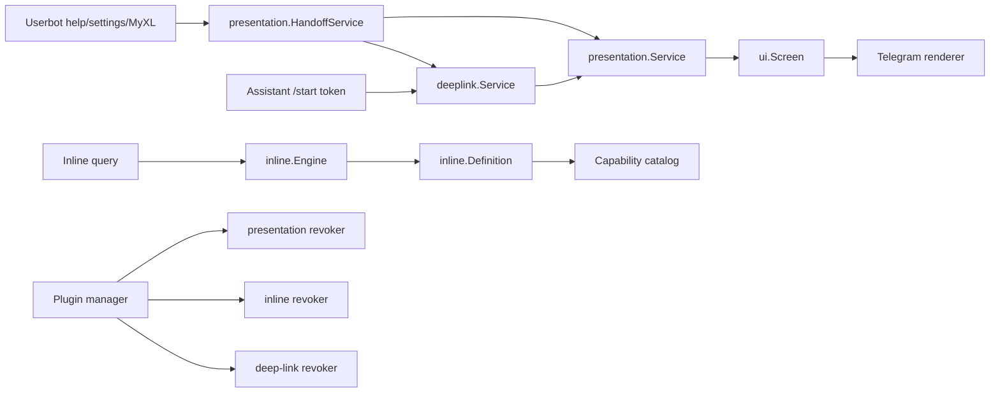

# Fase 1 — fondasi UX bersama untuk userbot, assistant, dan inline

Tanggal verifikasi ulang: 17 September 2026. Status: **sebagian besar fondasi sudah diterapkan, masih ada gap lifecycle dan enforcement sebelum dinyatakan selesai**.

Dokumen ini mencatat implementasi aktual pada working tree, bukan lagi rancangan sebelum implementasi. Status harus diperbarui berdasarkan kode dan test, bukan berdasarkan keberadaan package atau interface saja.

## 1. Ringkasan status

| Area | Status | Implementasi aktual | Sisa utama |
|---|---|---|---|
| Shared Screen/presentation builder | Hampir selesai | Registry, service, policy, validator, builder core dan MyXL tersedia | Standard `/start`, callback rebuild, dan inline result belum seluruhnya memakai presentation service |
| Inline capability metadata | Hampir selesai | Typed definition menjadi authority execution, catalog role-aware, chat-type filter, generation-aware cache key | Metadata validation dan lifecycle registration capability plugin belum lengkap |
| Deep-link token service | Hampir selesai | Hash-only SQLite, authorization-atomic consume, scope/generation, TTL, prune, restart persistence, `/start` consumer | Payload version/codec dan health/observability belum lengkap |
| Central screen access policy | Parsial | Build dan handoff memakai evaluator; menu owner sudah diteruskan | Callback/action lama belum memakai evaluator dan menu-owner masih fail-open bila fact tidak diberikan |
| Userbot-to-assistant handoff | Diterapkan untuk pilot | `.help`, `.settings`, dan `.myxl` memakai text deep-link pada userbot; assistant tetap dapat memakai markup | Narrow runtime ports dan mode non-pilot masih perlu diperketat |

Tidak ditemukan lagi isu lama “wrong user dapat membakar token”. Validasi scope dan generation sekarang dijalankan di dalam transaction sebelum update `consumed_at`.

## 2. Boundary arsitektur

Boundary yang dipertahankan:

- `core.Router` tetap menjadi sumber command canonical;
- `TaskEngine` tetap menjadi execution authority untuk pekerjaan resource-bearing;
- `internal/ui` menjadi model presentasi Telegram-agnostic;
- `internal/ui/render` menjadi adapter Telegram;
- `internal/presentation` mengatur screen registry, access policy, build validation, dan handoff;
- `internal/services/inline` mengatur capability discovery serta inline execution;
- `internal/services/deeplink` mengatur transisi lintas-surface yang persistent;
- `internal/app` menjadi composition root.

Architecture tests melarang `internal/ui` bergantung pada Telegram, database, task engine, atau plugin. `internal/presentation` juga dilarang bergantung pada raw Telegram client, `internal/app`, atau package plugin.

## 3. Arsitektur runtime aktual



Alur userbot → deep-link → assistant `/start` sudah tersedia dan mempunyai integration test berbasis SQLite nyata.

## 4. Shared Screen/presentation builder

### 4.1 Implementasi

`internal/presentation` menyediakan:

- `ScreenKey{Namespace, Name, Version}`;
- `BuildRequest` berisi actor, source, chat type, menu owner, locale, correlation ID, dan input;
- `BuildResult` berisi `*ui.Screen`, cache control, dan sensitivity;
- interface `Builder`;
- concurrency-safe `Registry` dengan owner/generation, lease, explicit duplicate policy, resolve, list, dan revoke;
- `Service.Build` dengan urutan resolve → authorize → deadline → build → validate;
- default timeout dua detik dan panic boundary;
- validasi text, row/button count, callback data 64 byte, URL scheme, serta sensitive/global-cache conflict.

Screen yang terdaftar:

| Key | Owner yang diharapkan | Policy |
|---|---|---|
| `core:start:v1` | `core`, generation 1 | public |
| `core:help:v1` | `core`, generation 1 | public |
| `core:settings:v1` | `core`, generation 1 | owner-only |
| `core:status:v1` | `core`, generation 1 | public |
| `myxl:dashboard:v1` | plugin scope MyXL | owner-only, private, sensitive |

Builder core masih membungkus fungsi `internal/assistant/menu`. Builder MyXL memanggil `BuildDashboardScreen` dan menghasilkan `SensitivitySensitive`.

### 4.2 Duplicate dan generation semantics

Registry sekarang:

- menolak key aktif milik owner berbeda;
- menolak replacement owner sama dengan generation lebih rendah atau sama;
- menerima replacement owner sama dengan generation lebih tinggi;
- memastikan lease generation lama tidak menghapus registration baru.

Perilaku tersebut mempunyai test khusus.

### 4.3 Gap tersisa

- `/start` tanpa token masih membangun start screen langsung melalui `menu.BuildStartScreen`, bukan `presentation.Service`.
- Callback menu lama belum melakukan rebuild melalui `presentation.Service`.
- Inline result masih mempunyai model builder sendiri; belum ada adapter canonical dari `ui.Screen` bila itu memang dibutuhkan.
- `CacheControl` belum mempunyai cache implementation.
- Locale belum digunakan builder.
- Builder dijalankan di goroutine. Timeout mengembalikan caller, tetapi builder yang mengabaikan context dapat terus hidup sampai selesai.

Status: **hampir selesai pada fondasi, migrasi seluruh caller belum selesai**.

## 5. Inline capability metadata

### 5.1 Implementasi

`internal/services/inline` mempunyai:

- `CapabilityID` dan `Capability` typed;
- owner/generation, matcher, access, cache, result kinds, priority, hidden, dan version metadata;
- `Definition`, `RegisterDefinition`, `DefinitionLease`, dan `RevokeOwner`;
- `ResolveDefinition`, sehingga engine memperoleh handler beserta metadata registration;
- compatibility registration untuk handler lama;
- catalog search dan filtering;
- authorizer catalog yang mengisi role owner/sudo dari permission service;
- chat-type filtering menggunakan peer type Telegram;
- execution authorization dari `Definition.Capability.Access`;
- cache key yang memasukkan capability version dan generation.

Built-in `help` dan `ping` didaftarkan sebagai definitions. Catch-all menampilkan capability catalog.

### 5.2 Authority dan compatibility

Engine sekarang memakai `Definition.Capability.Access` dan `Definition.Capability.Cache`. `InlineHandlerV2` hanya menjadi fallback bila metadata access belum diisi. Ini memperbaiki gap audit sebelumnya ketika catalog dan execution dapat membaca sumber policy berbeda.

Hal yang masih perlu diperjelas:

- fallback ke `InlineHandlerV2` tetap memungkinkan dua deklarasi policy; registration sebaiknya menolak konflik;
- metadata belum divalidasi ketat untuk ID, owner, version, cache policy, result kinds, dan kombinasi access;
- `AllowedChats` tidak dapat dibuktikan dari Telegram inline query dan execution sudah fail-closed, tetapi catalog belum secara eksplisit menyembunyikannya;
- filtering chat type hanya berjalan bila `PeerType` tersedia; policy dengan allowed chat type dan peer type nil sebaiknya fail-closed juga pada catalog;
- belum terlihat helper module untuk mengikat inline definition lease ke plugin scope seperti `RegisterScreen`.

Status: **hampir selesai, perlu validasi dan lifecycle registration**.

## 6. Deep-link token service

### 6.1 Implementasi

`internal/services/deeplink` dan subpackage SQLite menyediakan:

- token random 128-bit, base64url tanpa padding;
- SHA-256 token hash sebagai satu-satunya bentuk token di database;
- purpose, owner/generation, user scope, source chat, screen, typed payload metadata, single-use, issue/expiry/consume metadata;
- default TTL 10 menit dan maksimum 24 jam;
- payload maksimum 8 KiB;
- `Issue`, `IssueStartLink`, `Peek`, `Consume`, dan `RevokeOwner`;
- transaction SQLite untuk atomic consume;
- prune loop setiap 15 menit;
- idempotent `Start` dan `Stop`;
- active-generation resolver;
- synchronization username dari identity assistant setelah login;
- `/start <token>` consumer yang consume → policy-aware build → render → menu instance registration.

### 6.2 Security semantics yang terverifikasi

`Consume` sekarang membuat validator scope/generation dan menyerahkannya kepada `Repository.ConsumeAtomic`. Repository melakukan:

1. select record dalam transaction;
2. cek expiry dan consumed state;
3. jalankan validator user scope dan active generation;
4. baru update `consumed_at` secara conditional;
5. commit.

Dengan demikian wrong user, actor ID nol, dan stale generation tidak mengubah consumed state. Test juga mencakup attacker/owner race, restart persistence, invalid purpose, dan invalid open-screen key.

### 6.3 Handoff token

`HandoffService` sekarang membawa owner dan generation dari screen registration ke deep-link request. Input dipetakan menjadi `bytes`, `string`, atau JSON payload. TTL yang dikembalikan sudah memakai nilai setelah clamp. Username aktual diperbarui oleh assistant client melalui `SetAssistantUsername`.

Core screen memakai owner `core` dan generation konstan 1. Active-generation resolver runtime mengenali owner tersebut secara eksplisit sebelum mencoba plugin scope. Ini mencegah token `core:help`, `core:settings`, `core:start`, dan `core:status` ditolak sebagai stale hanya karena `core` bukan plugin. Plugin-owned token tetap divalidasi melalui generation pada `plugin.Manager.Scope`.

### 6.4 Gap tersisa

- `DeepLinkRequest` membawa `PayloadType`, tetapi belum membawa `PayloadVersion`; `IssueStartLink` juga belum mengisi payload version.
- JSON marshal failure di handoff diabaikan dan menghasilkan token tanpa payload; kegagalan sebaiknya dikembalikan kepada caller.
- Decode payload pada `/start` belum berdasarkan allowlisted codec; builder hanya menerima raw `[]byte` dari claim.
- `Health` selalu healthy dan belum menguji repository atau prune-loop state.
- Belum ada metrics/audit khusus issue, consume, reject, revoke, dan prune.
- Fallback username hard-coded masih ada sebelum assistant identity tersedia. Deployment perlu mencegah issue link sebelum username diketahui atau memakai configured username yang valid.

Status: **security-critical flow sudah diperbaiki; typed payload dan operasional masih perlu hardening**.

## 7. Central screen access policy

### 7.1 Implementasi

`AccessPolicy` mendukung public/authenticated/sudo/owner, source mask, chat-type mask, private-only, menu owner, sensitive marker, dan predicate.

Evaluator menghasilkan stable `DecisionCode`, audit reason, safe message, dan optional handoff hint. `presentation.Service.Build` dan `HandoffService` mengevaluasi registration policy. `BuildRequest.MenuOwner` sekarang diteruskan ke `PolicyRequest.MenuOwner`, dan terdapat test allowed/denied menu owner.

Deep-link tidak menganggap authorization saat issue sebagai otorisasi final. Setelah `/start`, screen dibangun ulang melalui service sehingga current policy diperiksa lagi.

### 7.2 Gap enforcement

- Evaluator mengevaluasi `RequireMenuOwner` secara fail-closed: jika `policy.RequireMenuOwner == true` dan `req.MenuOwner == 0`, request langsung ditolak dengan `DecisionDenyMenuOwner`.
- Callback router dan callback menu lama masih mempunyai authorization path sendiri; belum seluruh action melewati central evaluator.
- Inline memakai policy surface-specific. Ini dapat diterima, tetapi facts dan role resolution harus terus dijaga konsisten.
- `AccessPolicy.Sensitive` dan `BuildResult.Sensitivity` adalah dua sumber sensitivity tanpa invariant dua arah.
- Decision belum terhubung ke audit service dan metrics.
- Assistant `/start` sudah memakai generic safe token error. Build failure masih perlu dipastikan tidak mengirim detail internal ke pengguna.

Status: **central untuk build/handoff (fail-closed untuk menu owner), belum central untuk callback dan seluruh action**.

## 8. Userbot-to-assistant presentation handoff

### 8.1 Implementasi

`HandoffService` mendukung:

- render-here melalui presentation service;
- deep-link ke assistant;
- switch-inline artifact;
- automatic selection;
- `HandoffResult.AsScreen` untuk mengubah hasil menjadi screen renderable di surface pemanggil.

Pilot caller sudah tersedia:

- `.help` tanpa argumen meminta deep-link eksplisit;
- `.settings` memakai mode `Auto`;
- `.myxl`/`.myxl menu` memakai mode `Auto`;
- MyXL mempunyai canonical dashboard builder;
- assistant `/start <token>` menjadi consumer;
- integration test menguji attacker ditolak tanpa membakar token, owner menerima screen, dan reuse ditolak.

Tidak ada self-inline-query network round trip pada alur tersebut.

### 8.2 Semantics aktual

`Auto` memilih deep-link untuk screen require-private atau sensitive. Selain itu ia memilih render-here. `SwitchInline` hanya dipilih eksplisit dan belum mempunyai capability check. `DirectAssistant` masih dideklarasikan tetapi tidak diimplementasikan.

`.settings` sekarang meminta `HandoffDeepLink` secara eksplisit agar perilakunya sama dengan copy UX dan tidak bergantung pada keputusan `Auto` untuk screen yang hanya owner-only.

### 8.3 Masalah delivery fallback pada userbot (SELESAI)

Live behavior `.help` sebelumnya memperlihatkan pesan berikut tanpa tombol atau URL:

```text
Help Browser

📖 Interactive Help Browser

Open interactive help in the assistant bot:
```

Akar masalahnya:

1. `HandoffResult.AsScreen` menyimpan `DeepLinkURL` hanya sebagai URL button, bukan sebagai bagian body screen.
2. Plugin help merender screen lalu mencoba `ctx.EditMarkup(...)` pada jalur userbot.
3. Akun userbot bukan bot dan Telegram dapat menolak atau diam-diam membuang bot inline keyboard/reply markup walaupun RPC tidak mengembalikan error.
4. Jika RPC tampak sukses tetapi keyboard dibuang, fallback berbasis error tidak pernah dijalankan.
5. Karena URL hanya berada di markup, hasil akhirnya menyisakan prompt tanpa tindakan yang dapat digunakan.

Masalah ini kini telah diperbaiki secara terpusat:

1. **Fallback text & screen**: `presentation.HandoffResult` menyediakan `FallbackText(title, message string) string` dan `AsFallbackScreen(title, message string) *ui.Screen` yang selalu menyertakan tautan HTML yang dapat diklik (`👉 <a href="%s">Open in Assistant</a>`).
2. **Delivery adapter bersama**: Dibuat `render.DeliverHandoff(ctx, result, title, message, opts...)` di `internal/ui/render/delivery.go`. Adapter ini:
   - Dalam `DeliveryAuto`, surface userbot langsung memakai fallback text dan tidak mencoba bot reply markup, karena keberhasilan RPC tidak menjamin keyboard tampil.
   - Surface assistant atau mode delivery eksplisit tetap dapat mencoba `EditMarkup`/`ReplyMarkup`.
   - Jika pemasangan markup ditolak (misalnya `BOT_METHOD_INVALID`), adapter mencatat warning ke logger (hanya command dan error reason) tanpa pernah membocorkan token deep-link.
   - Melakukan graceful fallback ke pengiriman teks murni menggunakan `FallbackText`, sehingga pengguna tetap mendapatkan hyperlink yang valid dan fungsional.
   - Tidak pernah menampilkan raw internal error kepada pengguna.
3. **Adopsi di seluruh plugin**: `plugins/help`, `plugins/settings`, dan `plugins/myxl` kini menggunakan `render.DeliverHandoff`.
4. **Regression test lengkap**:
   - `internal/ui/render`: `TestDeliverHandoff_AutoUserbotUsesClickableTextWithoutMarkup`, `TestDeliverHandoff_EditWithMarkup_Success`, `TestDeliverHandoff_EditWithMarkup_FailureFallsBackToClickableLink`, dan `TestDeliverHandoff_ReplyWithMarkup_FailureFallsBackToClickableLink` (termasuk verifikasi zero-token-leakage pada log).
   - `plugins/help`: `TestHelpPlugin_UserbotHandoff_MarkupFailure_FallbackContainsURL`.
   - `plugins/settings`: `TestPlugin_UserbotHandoff_MarkupFailure_FallbackContainsURL`.
   - `plugins/myxl`: `TestMyXL_UserbotHandoff_MarkupFailure_FallbackContainsURL`.

### 8.4 Gap API

- `module.TelegramRuntime` masih mengekspos concrete `*presentation.Service` dan `*deeplink.Service`, selain narrow `HandoffClient`.
- Tidak ada narrow registration interface khusus screen/capability.
- `DirectAssistant` sebaiknya dihapus dari Fase 1 atau diimplementasikan dengan delivery semantics yang jelas.
- `SwitchInline` perlu capability check sebelum digunakan.

Status: **use case pilot sudah diterapkan; semantics dan API boundary perlu dirapikan**.

## 9. Plugin lifecycle dan penyelesaian registrasi MyXL

Plugin manager sekarang menerima presentation, inline, dan deep-link revoker. Disable dan shutdown merevoke owner dalam bentuk `name` dan `plugin:name`. Deep-link token yang membawa owner/generation juga diperiksa oleh active-generation resolver.

`plugin.Manager.Scope` dan `Find` telah dinormalkan untuk mendukung query dengan maupun tanpa prefiks `plugin:`, sehingga resolusi active generation dan scope identity bekerja konsisten.

Urutan registrasi MyXL telah diperbaiki:

1. buat plugin dan konfigurasi dependency;
2. panggil `rt.RegisterPlugin(...)` sehingga scope dibuat dan dikomit ke manager;
3. panggil `rt.RegisterScreen("myxl", ...)` setelah scope tersedia.

`module.Runtime.RegisterScreen` sekarang dievaluasi secara **fail-closed**:
- jika `pluginID` diberikan namun scope tidak ditemukan di `plugin.Manager`, registrasi langsung ditolak dengan error;
- tidak ada lagi fallback owner kosong untuk plugin-owned screen;
- screen lease terikat ke `scope.Defer(lease.Close)` sehingga cleanup otomatis berjalan saat disable/shutdown.

## 10. Verifikasi test

Perintah verifikasi:

```text
gofmt -l internal/app internal/architecture internal/assistant \
  internal/module internal/plugin internal/presentation \
  internal/services/deeplink internal/services/inline \
  plugins/help plugins/settings plugins/myxl \
  internal/ui/render

go test -count=1 -race ./internal/presentation \
  ./internal/services/deeplink/... \
  ./internal/services/inline \
  ./internal/assistant/command \
  ./internal/plugin \
  ./plugins/help ./plugins/settings ./plugins/myxl \
  ./internal/module \
  ./internal/architecture \
  ./internal/ui/render/...

go vet ./...
go build -v ./cmd/goultroid
```

Hasil:

- seluruh package pada race test di atas lulus dengan nol data race;
- `gofmt -l` bersih tanpa formatting issue;
- `go vet ./...` lulus tanpa temuan;
- `go build -v ./cmd/goultroid` berhasil mengompilasi binary produksi;
- integration test `TestEndToEnd_PluginLifecycle_RevocationAndGenerationIsolation` memastikan flow register → disable → reload mengisolasi screen dan menolak token generation lama;
- regression test delivery fallback pada `internal/ui/render`, `plugins/help`, `plugins/settings`, dan `plugins/myxl` memastikan saat markup ditolak userbot, body fallback tetap memuat URL/hyperlink assistant yang valid tanpa kebocoran token.

Belum dicakup oleh verifikasi ini:

- full `go test -race ./...`;
- `golangci-lint run --timeout=3m`;
- live Telegram smoke test.

## 11. Backlog berdasarkan prioritas

### P0 — lifecycle correctness (SELESAI)

1. [x] Perbaiki urutan `RegisterScreen` MyXL agar scope pasti tersedia.
2. [x] Buat plugin-owned registration fail-closed saat scope tidak ditemukan.
3. [x] Tambahkan integration test register → disable/reload → screen/token generation lama tidak dapat digunakan.
4. [x] Ubah menu-owner policy agar missing owner fact tidak fail-open.

### P1 — menyelesaikan Fase 1

1. [x] Perbaiki delivery fallback deep-link: bila markup ditolak, body wajib tetap memuat hyperlink/URL assistant (`render.DeliverHandoff` + `AsFallbackScreen`/`FallbackText`).
2. [x] Tambahkan regression test markup failure untuk help, settings, MyXL, dan jalur send/edit.
3. Migrasikan standard `/start` dan callback rebuild ke presentation service.
4. [x] Tegaskan behavior `.settings` sebagai deep-link dan samakan dengan copy UX.
5. Tambahkan payload version dan allowlisted codec; jangan abaikan serialization error.
6. Tambahkan helper lifecycle untuk inline definitions milik plugin.
7. Validasi capability metadata dan tolak konflik handler/definition policy.
8. Fail-closed catalog filtering bila peer facts yang diwajibkan tidak tersedia.
9. Kurangi concrete service exposure pada module runtime.

### P2 — operasional

1. Tambahkan audit dan metrics untuk policy, build, handoff, token, dan catalog.
2. Tingkatkan health check deep-link.
3. Implementasikan presentation cache atau keluarkan `CacheControl` sampai dibutuhkan.
4. Putuskan nasib `DirectAssistant` dan capability check `SwitchInline`.
5. Dokumentasikan kewajiban builder menghormati context.

## 12. Acceptance criteria revisi

Fase 1 dinyatakan selesai bila:

- help, settings, status, dan MyXL mempunyai canonical builder dan seluruh entry point utama memakainya;
- catalog dan inline execution memakai metadata authorization yang konsisten;
- deep-link hash-only, persistent, TTL-bound, user-scoped, generation-aware, dan authorization-atomic;
- wrong user/stale generation tidak dapat menggunakan atau menghabiskan token;
- build, token consume, callback, dan action memeriksa policy dengan facts lengkap;
- missing menu-owner fact fail-closed;
- plugin unload/reload membersihkan screen, inline capability, dan token generation lama;
- `.help`, `.settings`, dan `.myxl` mempunyai behavior handoff yang eksplisit dan teruji;
- deep-link tetap terlihat dan dapat diklik ketika Telegram menolak inline keyboard dari akun userbot;
- kegagalan markup mempunyai regression test dan observability tanpa mencatat token;
- internal errors tidak bocor kepada pengguna;
- full race suite, build, vet, lint, migration test, dan live smoke test lulus.

## 13. Keputusan desain yang masih perlu dikunci

1. Registration transaction plugin: rekomendasi membuat scope lebih dahulu dan memberikan scoped registrar kepada module.
2. Settings handoff: rekomendasi deep-link eksplisit bila target UX memang assistant; jangan mengandalkan `Auto` pada policy non-private.
3. Payload codec: rekomendasi typed JSON envelope dengan type, version, size bound, dan allowlisted decoder.
4. `DirectAssistant`: rekomendasi dikeluarkan dari Fase 1 sampai delivery permission dan failure semantics jelas.
5. Concrete runtime services: rekomendasi feature hanya menerima `HandoffClient`, `ScreenRegistrar`, dan port lain yang benar-benar diperlukan.
