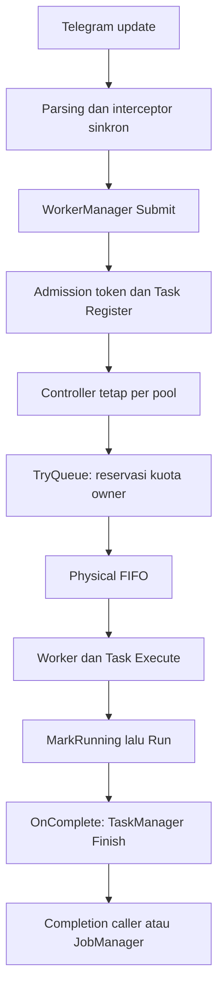

# Analisa teknikal: Worker, Task, Job, Scheduler, dan subsystem terkait

Tanggal: 14 September 2026. Status: analisa baseline untuk proposal, bukan laporan implementasi redesign.

Dokumen terkait: [rancangan dan evaluasi hasil yang diharapkan](../../adr/0006-execution-runtime-redesign.md), [rencana implementasi](03-implementation-plan.md).

## 1. Kesimpulan dan ruang lingkup

Redesign harus dimulai dari kontrak ownership, kapasitas, identitas execution, dan durability. Mengganti nama package atau memindahkan semaphore saja tidak menyelesaikan interaksi di antara keempatnya. Targetnya adalah satu model execution yang digunakan semua pekerjaan fitur, dengan pengecualian eksplisit untuk loop transport dan infrastructure yang memang berumur panjang.

Baseline sudah memiliki perbaikan penting: worker terisolasi, admission bounded, pemisahan `Admitted`/`Queued`/`Running`, completion pada panic/cancellation, submission nonblocking untuk timer, dan periodic retry sebagai Task terpisah. Semua ini menjadi persyaratan regresi redesign. Desain dari nol tidak berarti membuang tes, format data, atau perilaku pengguna yang masih benar.

Cakupan analisa meliputi:

- physical execution, admission, owner quota, fairness, priority, ordering, dan backpressure;
- Task lifecycle, cancellation, timeout, hasil, dan retention;
- Job definition, recurring occurrence, attempt, retry, idempotency, persistence, dan recovery;
- Scheduler, periodic maintenance, waktu, lease, dan transaksi SQLite;
- Runtime/App, Telegram transport dan ingress, dispatcher, callback, inline, plugin scope, EventBus, media/process, serta diagnostics;
- struktur package, API, style Go, algoritma, testing, dan strategi migrasi.

Tidak termasuk rewrite seluruh plugin, penggantian Telegram library, migrasi database ke server eksternal, atau penerapan distributed worker cluster dalam versi pertama. Perubahan flow fitur hanya dilakukan bila diperlukan untuk mematuhi kontrak execution baru.

## 2. Baseline yang benar-benar diperiksa

| Item | Nilai |
|---|---|
| Branch lokal | `fix/execution-admission-periodic` |
| HEAD saat analisa dimulai | `03ed71c` — `fix(scheduler): satisfy connection close errcheck` |
| Checkpoint source saat finalisasi | `bfe7f0d` — `fix`; patch baseline telah tercatat sebagai commit ini |
| Sumber analisa | HEAD **ditambah perubahan staged/unstaged dari perbaikan sebelumnya** |
| Fingerprint awal diff tracked | SHA-256 `68f5877eda75709c8c3d16c834abf3b7c738fdb62075a1e66fece6f765eaac06`, dari `git diff HEAD --binary`, sebelum dokumen proposal ini dibuat |
| Go yang dideklarasikan | `go 1.27.0`, mengikuti `go.mod` |
| Metode | Pembacaan source, pemetaan call path, pembacaan tes, menjalankan ulang tes package inti |
| Tidak dilakukan | Profiling produksi, load test Telegram, benchmark before/after redesign, implementasi arsitektur proposal |

Fingerprint diff adalah penanda patch tracked, bukan hash seluruh repository atau bukti provenance artefak binary. Baseline ini **bukan `main` murni**. Pembaca yang hanya membuka HEAD tanpa patch lokal akan melihat implementasi berbeda.

Selama penyusunan dokumen, HEAD bergerak ke `bfe7f0d`. Diff dari `03ed71c` ke source checkpoint tersebut, dengan dokumen proposal baru dan index ADR dikecualikan, menghasilkan fingerprint yang sama. Untuk mereproduksi baseline final, gunakan `bfe7f0d`; perubahan source yang dianalisa tidak berubah selama penulisan dokumen.

Label bukti yang digunakan:

- **Source**: mekanisme terlihat langsung pada kode.
- **Test**: perilaku tertentu dicakup tes yang lulus; cakupannya terbatas pada scenario tes.
- **Inference**: konsekuensi interleaving atau tekanan sistem yang diturunkan dari source, belum diukur/reproduksi khusus dalam pekerjaan dokumentasi ini.
- **Proposal**: keputusan baru; belum menjadi perilaku aplikasi.

## 3. Inventaris sumber dan batas tanggung jawab saat ini

| Area | Sumber utama | Tanggung jawab aktual |
|---|---|---|
| Workers | [manager.go](../../../internal/workers/manager.go), [pool.go](../../../internal/workers/pool.go), [reservation.go](../../../internal/workers/reservation.go) | Admission, wrapping Task, quota handoff, pool goroutine, reservasi, drain |
| Tasks | [task.go](../../../internal/tasks/task.go), [manager.go](../../../internal/tasks/manager.go) | Struct execution, `Execute`, completion, active registry, quota, cancellation, metrics |
| Jobs | [job.go](../../../internal/jobs/job.go), [manager.go](../../../internal/jobs/manager.go), [repository.go](../../../internal/jobs/repository.go) | Definition dan state bersama, trigger, result waiter, persistence, restart reconciliation |
| Scheduler | [engine.go](../../../internal/scheduler/engine.go), [repository.go](../../../internal/scheduler/repository.go) | Deadline, durable claim, wrapper execution, misfire, lease renewal, retry, Telegram action |
| Periodic | [periodic_timer.go](../../../internal/scheduler/periodic_timer.go) | Registration map, scan deadline, single timer, attempt counter, completion, retry timing |
| Queue | [queue.go](../../../internal/queue/queue.go) | FIFO slice, policy push, notification channel, condition variables |
| Lifecycle | [Runtime](../../../internal/runtime/runtime.go), [App lifecycle](../../../internal/app/lifecycle.go), [shutdown](../../../internal/app/shutdown.go) | Runtime DAG serta façade/state/shutdown App; Telegram Run terpisah |
| Ingress | [dispatcher](../../../internal/telegram/dispatcher_dispatch.go), [callback](../../../internal/telegram/dispatcher_callback.go), [peer lifecycle](../../../internal/telegram/dispatcher_peer.go) | Interceptor, routing, command submission, callback/inline inline execution |
| Transport | [client.go](../../../internal/telegram/client.go) | Connection, authentication, service/resolver, peer warm-up, update recovery |
| Plugin | [scope.go](../../../internal/plugin/scope.go), [manager.go](../../../internal/plugin/manager.go), [context.go](../../../internal/plugin/context.go) | Scoped goroutine, resource cleanup, manager exposure, disable cancellation |
| Infrastructure | [EventBus](../../../internal/core/events.go), [SQLite](../../../internal/database/db.go) | Event delivery terpisah dan persistence bersama |
| Diagnostics | [app diagnostics](../../../internal/app/diagnostics.go), [dispatcher counters](../../../internal/telegram/dispatcher_accessors.go) | Snapshot beberapa subsystem; belum satu execution view |

`internal/execution` sudah dipakai untuk konteks actor/source/capability dan response surface. Nama tersebut tidak boleh diam-diam diubah menjadi physical executor. Proposal memakai package orchestration baru dengan batas yang jelas.

## 4. Flow aktual setelah perbaikan terakhir

### 4.1 Command dan Task biasa



`Running` sudah dimulai ketika worker masuk execution body. Kuota owner yang membatasi concurrency masih direservasi sejak `TryQueue`, sehingga kuota aktif berbeda dari jumlah handler yang benar-benar berjalan. Perbedaan ini perlu nama dan metrik eksplisit.

Physical queue dan admission queue adalah dua buffer. Batas antrean konfigurasi bukan total jumlah accepted task. Payload/closure juga belum memiliki budget byte yang terpisah.

### 4.2 Durable scheduled work

```text
query deadline -> reserve PoolScheduler -> claim row/lease SQLite
 -> wrapper Task -> send message / execute command / TryTrigger(managed job)
 -> complete/fail scheduled row
```

Untuk `ActionJob`, completion scheduled row sekarang berarti trigger/admission managed job berhasil. Hasil attempt managed job berjalan melalui JobManager kemudian. Ini bukan lagi deadlock `TriggerAndWait`, tetapi juga belum model occurrence/attempt yang menyatukan hasil keduanya.

### 4.3 Periodic

```text
scan map -> collect due -> TrySubmit(PoolGeneral)
 -> satu Task / satu attempt -> OnComplete
 -> update registration dan deadline retry/interval
```

Retry delay sudah tidak tidur di physical worker. Namun retry policy, identity, metrics, dan lifetime periodic masih merupakan domain kedua di samping Jobs. Nama registration digunakan sebagai map key; owner menjadi metadata, bukan bagian identitas key.

## 5. Bagian yang sudah benar dan harus dipertahankan

| Perbaikan baseline | Bukti | Persyaratan redesign |
|---|---|---|
| Task panic menghasilkan terminal result | `tasks/completion_test.go`, `workers/admission_regression_test.go` | Setiap accepted execution punya satu terminal outcome |
| Kuota dilepas setelah panic | `TestManagerPanicReleasesOwnerAndReportsCompletion` | Physical finish tidak boleh menyisakan owner reservation |
| Cancellation membangunkan admission | `TestManagerCancellationWakesAdmission` | Cancellation tidak bergantung pada pekerjaan lain selesai |
| Capacity generation diambil sebelum scan | `workers.Manager.admissionLoop` | Tidak ada lost wakeup pada check-then-wait |
| Submit dari scheduler/periodic nonblocking | `scheduler/admission_regression_test.go` | Timer dan worker tidak menunggu kapasitas pool tujuan |
| Pending physical tasks difinalisasi saat pool dibatalkan | `TestManagerPoolCancellationFinalizesQueuedTasks` | Accepted work tidak hilang dari accounting saat shutdown |
| Retry periodic memakai Task ID baru | `TestPeriodicRetriesUseSeparateTasksAndTimerDelay` | Satu Task adalah satu attempt |
| Runtime mengurutkan quiesce/drain/stop | `runtime/runtime.go` dan tesnya | Dependency tetap tersedia selama consumer drain |
| Claim SQLite memakai writer intent sejak awal | `scheduler/repository.go`, concurrency tests | Tidak mengembalikan race upgrade transaksi read-to-write |
| PRAGMA berlaku per connection produksi | `database/db.go` | Uji file database dengan pool connection aktual |

Tes lulus tidak membuktikan semua interleaving. Khusus lost wakeup, tes burst melengkapi alasan correctness pada urutan subscription dan pengecekan kondisi; bukan pembuktian exhaustive concurrency.

## 6. Gap struktural dan failure mode tersisa

### A-01 — Ownership state masih menyebar

**Source.** Task runtime disalin ke queue, registry menyimpan salinan lain, worker menghitung busy, admission mengelola quota handoff, dan `Task.Execute` mengubah state lokal. Completion wrapper menjahitnya. App memiliki lifecycle state sendiri sementara Runtime juga mempunyai state machine.

**Dampak.** Menambah state/deadline membutuhkan sinkronisasi perubahan lintas komponen. Snapshot antar subsystem bukan transaksi atomik. Target baru perlu satu owner untuk mutable state execution; Task spec dan result menjadi value terpisah.

### A-02 — Reservasi physical capacity belum universal

**Source.** `TryReserveExecution` menjumlahkan `pool.busy` dan counter dalam package-level `sync.Map`. Submission biasa dan worker pop tidak harus mengonsumsi token reservasi yang sama. Handle reservation juga tidak membawa pool/task identity yang divalidasi oleh `SubmitReserved`.

**Inference.** Reservasi dapat dibuat ketika slot idle, lalu pekerjaan biasa mengambil slot itu sebelum reserved task dispatch. Ini tidak membuat jumlah worker melewati concurrency, tetapi menggagalkan jaminan “lease diklaim hanya ketika ada slot physical yang benar-benar dipesan”. Membaca dua atomic counter bukan transaksi pemesanan resource.

**Kebutuhan.** Permit harus mewakili worker slot nyata, terikat pool/slot/generation/request, sekali pakai, dan semua producer melalui jalur yang sama.

### A-03 — Fairness, priority, queue deadline, dan ordering belum satu policy

**Source.** Admission scan memilih request yang eligible dari slice pending; physical queue FIFO. `Task.Priority` tidak menjadi pemilih admission. `MaxConcurrent` global owner dihitung sejak queued; tidak ada queue deadline khusus dalam Task.

**Dampak.** Bypass owner yang terkena quota membantu head-of-line blocking, tetapi bukan round robin berweight. Task stale dapat menunggu sebelum execution timeout mulai. Task paralel untuk satu chat tidak otomatis menjaga ordering yang dibutuhkan stateful feature.

**Kebutuhan.** Definisikan unit fairness, namespace owner, priority class, biaya dispatch, expiration, dan ordering key sebelum memilih algoritma. Jangan mengklaim priority bisa mem-preempt handler yang sudah berjalan.

### A-04 — JobID dipakai sebagai identitas hasil banyak attempt

**Source.** `Trigger` tidak membatasi overlap secara eksplisit; beberapa trigger dapat mengacu pada pointer Job yang sama. Completion waiter dikelompokkan berdasarkan `jobID`; `notifyCompletion` mengambil semua waiter untuk ID tersebut. Repository `UpdateState` memakai `WHERE id = ?`, tanpa attempt/version fencing.

**Inference.** Completion attempt A dapat memenuhi waiter B atau menimpa aggregate state ketika B masih berjalan. Race detector tidak menjamin mendeteksi salah korelasi yang tetap dilindungi mutex. Rollback submission juga berpotensi menulis state lama setelah trigger lain maju.

**Kebutuhan.** Pisahkan JobDefinition, JobOccurrence, dan JobAttempt. Waiter harus terikat AttemptID/OccurrenceID. Tentukan overlap policy dan bandingkan version/epoch ketika mutate state.

### A-05 — Reliable callback belum sama dengan durable result

**Source.** `OnComplete` sudah memperbaiki jalur terminal dalam proses. JobManager masih mengabaikan beberapa error `repo.UpdateState`. Completion persistence dapat berjalan sinkron dalam worker atau admission controller dan memakai `context.Background()`.

**Dampak.** Database lambat menahan jalur execution/control. Database gagal dapat membuat result memori berbeda dari durable row. Process crash setelah side effect sebelum persist tetap menghasilkan ambiguity.

**Kebutuhan.** Result inbox bounded dengan kapasitas yang dipesan sebelum admission; persistence acknowledgement, idempotent completion, explicit commit-pending state, dan recovery untuk hasil yang tidak pernah committed. Hindari klaim exactly-once external effect.

### A-06 — Durable schedule dan managed Job adalah dua execution domain

**Source.** Tabel `scheduled_jobs` menyimpan payload action, retry attempt count, lease, status, history. `managed_jobs` menyimpan schedule/next run/state sendiri. Scheduler juga mengetahui router, permission, Telegram peer, executor, dan cara mengirim pesan.

**Dampak.** Perubahan retry, cancellation, history, atau recovery berpotensi memiliki dua arti. Managed wrapper memesan PoolScheduler, sementara execution nyata bisa memilih pool lain. Overload bisa dihitung sebagai failure pada domain scheduled meskipun handler managed belum dimulai.

**Kebutuhan.** Jadikan Scheduler penghasil deadline. Adaptasikan message/command ke handler Job dengan payload berversi. Durable ready occurrence bukan execution lease; kedua konsep tidak boleh dicampur.

### A-07 — Periodic dan service maintenance belum menyatu

**Source.** Periodic memakai dua scan map untuk deadline/due; unregister berdasarkan nama dapat bertabrakan antar owner. Callback state store dan inline cache masih punya ticker prune sendiri. Plugin Scope.Go melakukan direct goroutine dengan resource tracking.

**Dampak.** Timer pusat belum menjadi sumber seluruh timing. Goroutine scope terlacak belum tentu bounded secara execution. Namun loop transport/stream yang selalu hidup juga tidak tepat dimasukkan ke pool finite task.

**Kebutuhan.** Timer heap ber-key `(owner, name, generation)`; periodic sebagai Job in-memory; maintenance prune melalui workload class yang sama. Long-lived service tetap disupervisi terpisah dengan budget dan kontrak lifecycle.

### A-08 — Runtime belum menutup ingress secara formal sebelum admission

**Source.** App menjalankan `client.Run` setelah `runtime.Start`. Dispatcher mematikan accepting flag di `Stop`, tidak mengimplementasikan `Quiesce`, dan dependency-nya hanya `eventbus`. Scheduler.Quiesce membatasi durable claim, tetapi periodic coordinator dihentikan pada StopContext.

**Dampak.** Masih ada producer yang hidup ketika phase quiesce worker telah menutup admission. Memasukkan seluruh Telegram client sebagai component terakhir tanpa memisahkan transport juga berbahaya: RPC mungkin mati sebelum task drain selesai.

**Kebutuhan.** Pisahkan lifetime transport/RPC dan ingress gate. Ingress tutup pertama; transport tetap tersedia sampai execution dan outbound drain selesai. Plugin quiesce tidak langsung membongkar dependency yang dipakai active task.

### A-09 — Jalur Telegram memiliki execution di luar policy pusat

**Source.** Interceptor bernama `asyncHandlers` tetap dipanggil sinkron. Callback router dan inline engine dipanggil langsung dari update handler. Dispatcher memiliki fallback goroutine bila WorkerManager tidak terpasang serta package-level mapping ke workers.

**Dampak.** Latency ingress bergantung pada feature middleware. Callback/inline tidak berbagi aturan queue deadline dan overload. Fallback membuat konfigurasi salah dapat berubah menjadi jalur execution lain.

**Kebutuhan.** Gate cepat dengan budget, observer async bounded, callback acknowledgement dengan semantik yang tidak menyatakan sukses palsu, inline dengan hard deadline aplikasi, dan constructor dependency yang wajib. Urutan permission/idempotency tidak boleh berubah saat dipindah async.

### A-10 — Pool limit bukan satu-satunya batas resource

**Source.** Media ResourceGuard memiliki semaphore dan validasi ukuran/disk. Process runner, network policy, rate limiter, stream, dan EventBus memiliki batas masing-masing.

**Dampak.** Menghapus seluruh semaphore sebagai tujuan arsitektur akan menghilangkan perlindungan resource yang berbeda. Menunggu semaphore media di dalam banyak worker juga menyia-nyiakan kapasitas.

**Kebutuhan.** Pisahkan physical slot, memory/disk/process budget, dan remote rate limit. Resource yang diperlukan sebelum dispatch direservasi secara konsisten; rate limit transport tetap dimiliki lapisan RPC. Long external waits harus menjadi deferred retry jika semantics operasinya memungkinkan.

### A-11 — Observability dan memory bounds belum mewakili keseluruhan flow

**Source.** Diagnostics command membaca `cmdSem` lama. Active owner counters dan package-level pool/dispatcher maps tidak menunjukkan kebijakan eviction yang menyatu dengan lifecycle. Queue slice sekarang mengosongkan slot yang dilepas, tetapi masih melakukan front reslicing; tidak ada bounded result retention/byte budget dalam satu model.

**Dampak.** Pool busy, quota reserved, admission wait, queue wait, dan commit wait mudah tertukar. Bounding jumlah item tidak membatasi ukuran payload atau jumlah owner yang pernah dilihat.

**Kebutuhan.** Definisikan cardinality, payload budget, registry/result retention, snapshot consistency, dan metrik setiap transition. Ring buffer dipakai untuk mailbox yang cocok, bukan dipaksakan menggantikan semua struktur scheduling.

### A-12 — Nama API dan style menyembunyikan semantics

**Source.** `SetMaxConcurrency` tidak menentukan physical scheduler concurrency pada jalur WorkerManager. `WaitStart`/`TryStart` compatibility masih ada. `Task.Retry` menjadi metadata legacy. `EventBus.PublishDurable` memanggil subscriber secara sinkron dalam proses; itu bukan database-backed durable delivery.

**Kebutuhan.** API menyatakan admission vs completion, logical vs physical, dan in-memory vs persisted. Hindari setter setelah Start, optional type assertion untuk fitur wajib, object-pointer global maps, error persistence yang diabaikan, serta interface besar hanya untuk meniru struct.

## 7. Analisa kapasitas dan algoritma baseline

Default physical workers berjumlah `8 + 32 + 3 + 2 + 4 = 49`. Default queue capacity berjumlah `200 + 128 + 50 + 20 + 100 = 498`. Admission token juga dibatasi per pool; untuk jalur managed, upper envelope jumlah item outstanding secara konfigurasi sekitar `498 admission + 498 physical queued + 49 running = 1.045`, sebelum owner quota dan kondisi transisi memperketatnya. Angka ini bukan jumlah goroutine atau batas byte memory, dan bukan seluruh pekerjaan aplikasi.

| Operasi | Baseline | Implikasi |
|---|---|---|
| Scan admission | O(P) pemeriksaan per pass, removal slice O(P) | Satu burst bisa memerlukan kerja kuadratik karena pergeseran elemen; bounded tetapi contention/latency tetap perlu diukur |
| Owner quota lookup | O(1) rata-rata map | Mutex global dan broadcast lintas controller masih ada |
| Physical FIFO | Slice + condition variable | Pop tidak menggeser elemen, tetapi append setelah reslice dapat mengalokasikan backing array baru |
| Periodic deadline/due | O(N) scan per cycle | Memadai untuk kecil, kurang cocok saat registration/due burst besar |
| Scheduled next due | Query database + timer | Idle heartbeat 60 detik dan backoff ketika due tetapi kapasitas habis |
| Claim | Transaksi SQLite writer intent | Aman dari sebagian race claim; durasi lock/query/index tetap perlu benchmark |
| Completion Job | Callback + DB update | Latency persistence dapat masuk critical path worker/control |

49 blocked goroutine tidak dengan sendirinya berarti CPU tinggi. Sebaliknya, jumlah worker kecil tidak menjamin memory kecil jika closure memegang media buffer besar. Estimasi CPU/RAM nyata membutuhkan workload dan profiling.

## 8. Skenario beban dan kegagalan yang harus membimbing desain

| Skenario | Pertanyaan yang harus dapat dijawab |
|---|---|
| Idle tanpa job | Berapa timer wake, query, allocation, dan goroutine supervisor yang benar-benar aktif? |
| Satu user burst | Apakah user lain dan pekerjaan control tetap memperoleh dispatch? |
| Banyak owner lintas pool | Apakah kuota owner global atomik, tanpa double reservation? |
| Media CPU penuh | Apakah callback/inline mendapatkan latency yang layak tanpa menjanjikan preemption? |
| Ribuan periodic jatuh tempo | Apakah timer tetap responsif, memory bounded, dan retry tidak menjadi storm? |
| SQLite busy/down | Apakah execution baru berhenti sebelum result buffer habis? Apakah hasil terminal tetap dapat direkonsiliasi? |
| Crash setelah external effect | Apakah status menjadi unknown/recoverable dan duplicate policy diketahui? |
| Cancel/reload plugin ketika dispatch | Apakah generation lama tidak bisa memulai pekerjaan baru? |
| Shutdown saat claim/result commit | Siapa menunggu siapa, kapan transport/DB boleh ditutup? |
| Clock maju/mundur | Apakah recurrence/misfire/lease mempunyai kebijakan yang deterministik? |

## 9. Bukti validasi dan batas analisa

Pada pekerjaan dokumentasi ini dijalankan ulang:

```sh
go test -race ./internal/workers ./internal/tasks ./internal/jobs ./internal/scheduler ./internal/runtime ./internal/architecture
```

Hasil: lulus; beberapa package menggunakan Go test cache. Pada turn perbaikan sebelumnya, full race suite, vet, lint, build, dan generator juga lulus pada patch implementasi tersebut. Hasil itu adalah bukti baseline, bukan validasi proposal ADR 0006.

Belum ada angka p50/p95/p99, throughput, RSS, CPU, atau savings redesign yang diukur. Dokumen rancangan memuat evaluasi mekanisme dan hipotesis; dokumen rencana menentukan cara mengisi hasil terukur sebelum cutover.

## 10. Keputusan arah

Desain baru harus menghilangkan penggandaan ownership, bukan sekadar menambah AdmissionController ketiga. Pilihan yang diajukan: satu coordinator execution yang memegang state dan permit inventory, physical workers tanpa logical quota, Job/Occurrence/Attempt yang terpisah, satu deadline engine, result persistence yang tidak meminjam physical worker, serta pemisahan Telegram ingress dari transport.

Prioritas correctness adalah identitas attempt dan fencing, admission capacity yang nyata, completion dengan acknowledgement, kemudian lifecycle. Fairness, priority, style, dan optimasi data structure dibangun di atas invariant tersebut, bukan ditempelkan setelah flow baru berjalan.
