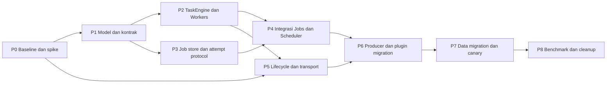

# Rencana rework dan redesign execution runtime

Tanggal: 14 September 2026. Status: **rencana, belum dieksekusi**.

Baca terlebih dahulu [analisa teknikal](01-technical-analysis.md) dan [ADR 0006: rancangan serta evaluasi hasil yang diharapkan](../../adr/0006-execution-runtime-redesign.md).

## 1. Outcome dan batas pekerjaan saat ini

Pekerjaan yang diminta pada tahap ini menghasilkan dokumen, bukan implementasi ulang subsystem. Tidak ada migrasi DB, cutover producer, perubahan pool configuration, atau penghapusan kode lama dalam tahap dokumentasi.

Outcome implementasi kelak: Worker, Task, Job, Scheduler, ingress, dan resource lifecycle mengikuti kontrak ADR 0006, dengan bukti migration safety, correctness, responsiveness, dan operability. “Selesai” tidak cukup berarti compile atau unit test hijau.

Baseline menggunakan branch `fix/execution-admission-periodic` dengan perbaikan sebelumnya yang telah tercatat sebagai `bfe7f0d` saat finalisasi dokumen, bukan main murni. Sebelum mulai coding, catat ulang checkpoint source dan artefak test yang reproducible; jangan menghapus, overwrite, atau menganggap staged changes milik pengguna sebagai file sementara.

## 2. Prinsip pelaksanaan

1. Desain internal boleh baru seluruhnya; migrasi berjalan melalui batas yang dapat diuji dan dibalik.
2. Satu producer/ownership partition hanya memiliki satu executor aktif. Shadow mode tidak menjalankan side effect kedua.
3. Test failure yang menunjuk invariant baru diperbaiki pada implementation; jangan menurunkan tes hanya agar adapter lolos.
4. Compatibility adapter mempunyai daftar caller dan exit condition. Tidak ada fallback goroutine/permissive execution ketika dependency wajib hilang.
5. Tidak menambah distributed system, generic workflow engine, atau pool autoscaling sebelum problem versi pertama selesai.
6. Schema additive dahulu. Drop legacy table/API hanya setelah cutover, recovery exercise, dan rollback window selesai.
7. Semua perubahan performance dibandingkan terhadap baseline yang sama; angka dugaan tidak dimasukkan ke kolom hasil ukur.

## 3. Urutan phase dan dependency



P2/P3 memiliki dependency interface yang sama dan secara teknikal dapat dikerjakan terpisah setelah P1 stabil; diagram ini bukan instruksi menjalankan agent paralel. Sebelum data/producer production cutover, keduanya wajib terintegrasi dan lulus failure tests.

### P0 — Freeze baseline, inventaris caller, dan spike berisiko tinggi

**Deliverables**

- Checkpoint hash commit + patch, manifest file berubah, Go/tool versions, hasil suite dan config pool baseline.
- Inventaris seluruh pemanggil Submit, direct Pool.Submit, Trigger/Wait, periodic registration, Scope.Go, callback/inline, serta middleware berat.
- Tabel compatibility per surface: command name/output, permission, ordering, queue lifetime, cancel, retry, history, dan overload feedback.
- Harness fake clock, ID generator, scripted worker, store fault injection, dan fake Telegram service tanpa credential/network side effect.
- Spike Telegram: authenticated RPC tetap hidup ketika business ingress/recovery intake berhenti; ready/error/stop channel dan startup rollback dapat dibuktikan dengan gotd version repository.
- Model kecil permit/result credits dengan simulator event untuk mixed ordinary/durable producers.
- Baseline benchmark B0–B8 pada bagian 8.

**Gate keluar**

- Perbedaan current main/branch/patch jelas dan dapat direproduksi.
- Tidak ada klaim performance tanpa artefak ukur.
- Adapter transport mempunyai bukti atau blocker teknikal konkret. Bila stop recovery terpisah tidak tersedia, desain gate/cursor ditulis dan diuji sebelum phase lifecycle.
- Invariant test lama yang melindungi lima fix terakhir masuk daftar mandatory regression.

**Rollback**: belum ada perubahan production. Spike berada di test harness/adapter yang tidak wired ke App.

### P1 — Model domain, API, config, dan contract tests

**Deliverables**

- Immutable WorkSpec, TaskResult, TaskSnapshot, typed IDs, ScopeIdentity, QuotaOwner, priority/cause enums.
- JobDefinition/JobSchedule/JobOccurrence/JobAttempt dan payload version registry.
- Kontrak Submit admission decision dengan cancellation linearization, ticket/attempt handle, snapshot, scoped cancel.
- Port prepare/commit-ack, worker assignment/result, timer deadline sink, dan repository transaction.
- Validated config: worker counts, waiting count/bytes, result credits, owner limits, decision/queue/prepare/execution deadlines, retention.
- Tambahan architecture tests untuk dependency package baru dan forbidden handler imports.
- `TrySubmit`, `WaitStart`, `Task.Retry`, global maps, dan optional setter diberi migration inventory, belum dihapus secara membabi buta.

**Gate keluar**

- Spec/result tidak mengandung mutable manager pointer atau persisted closure.
- Contract test membuktikan rejection tidak membuat active Task, accepted task mempunyai ticket, dan cancel-vs-accept tidak menghasilkan execution tersembunyi.
- Unknown handler/payload version dan invalid owner/class/resource requests ditolak jelas.

**Rollback**: types/packages baru belum mengubah production routing.

### P2 — Physical executor, TaskEngine, admission, dan result inbox

**Deliverables**

- Fixed workers dengan per-slot permit, assignment generation, single-attempt execution, start/finish timestamps, panic boundary.
- Satu coordinator TaskEngine yang memiliki mutable Task registry dan capacity inventory.
- DRR class/owner, eligible/blocked owner index, arbitrary cancellation, indexed queue deadlines, ordering key.
- Result credit reservation sebelum acceptance, bounded result inbox, handle retention dan eviction.
- Atomic all-resource reservation sebelum dispatch; worker tidak menunggu logical quota/media semaphore di execution body.
- Metrics physical/reserved/waiting/commit-pending terpisah.
- In-memory adapter untuk direct command/task, belum production default.

**Gate keluar**

- Conservation invariant lolos property/model test untuk enqueue/start/cancel/finish/expire/worker-stop semua interleaving kecil.
- Mixed reserve + ordinary submit tidak bisa mengambil worker slot yang sama; wrong-pool/task/generation grant ditolak.
- Panic, parent cancel, queue expiry, pre-start cancel, callback failure isolation, dan pool abort menghasilkan tepat satu terminal result.
- Result capacity tidak pernah dilanggar, termasuk saat sink tidak meng-ack.
- Cross-pool global quota konsisten; fairness equal-cost test memenuhi configured share dalam toleransi sampling yang disepakati.
- Tidak ada per-task admission waiter goroutine. Memory setelah idle/retention purge tidak terus bertambah antar burst identik.

**Rollback**: route seluruh producer ke executor lama; engine baru berhenti melalui Runtime, tanpa side effect ganda.

### P3 — Store Job baru, occurrence identity, dan durable attempt protocol

**Deliverables**

- Schema additive dan repository di domain Jobs, sesuai batas generic database.
- Unique occurrence/attempt/task keys; version/epoch CAS; cancellation tombstone; overlap policy.
- Materialize due occurrence transaction, bounded ready-page query, execution-prepare lease transaction, completion+retry+outbox transaction.
- Persistence pump yang tidak memakai feature worker pool; operation deadlines dan bounded retries.
- Recovery planner untuk ready, leased-not-started, running-expired, result-unknown, cancelled, unknown-handler.
- Store in-memory untuk periodic memakai transition/policy yang sama, bukan retry implementation kedua.

**Gate keluar**

- Completion attempt A tidak memenuhi handle B; stale completion tidak mengubah occurrence baru.
- Duplicate materialization/manual idempotency mengembalikan identity yang sama, tanpa duplicate active attempt.
- DB transaction rollback tidak meninggalkan cache committed palsu; error persistence tidak diabaikan.
- Semua crash windows pada bagian 7 mempunyai hasil deterministik/recovery disposition eksplisit.
- File SQLite tests memakai WAL/pool connection konfigurasi produksi. Tes `:memory:` bukan satu-satunya bukti concurrency.

**Rollback**: tabel baru tidak dibaca producer production; data legacy tetap authoritative.

### P4 — Integrasi JobManager, Scheduler heap, dan periodic

**Deliverables**

- Timer heap indexed, stable tie-breaking, owner/name/generation key, bounded due batches.
- Scheduler hanya menghasilkan due references; materialization/execution retry di JobManager.
- Ready intent -> fair admission -> physical permit -> prepare grant -> worker -> result ack end-to-end.
- Periodic registration menjadi Job in-memory dengan shared retry/misfire/overlap semantics.
- Lease renewal/expiry di control-plane scheduling, tidak satu ticker/goroutine per execution.
- Message/command scheduled action diubah menjadi versioned Job handlers melalui adapter capability yang sudah ada.
- Recurring/misfire/interval semantics lama memiliki golden tests; legacy wrapper PoolScheduler tidak lagi menjadi execution kedua.

**Gate keluar**

- Ribuan due timers tidak memblokir cancel/completion; queue-full tidak menjadi busy loop atau handler retry budget.
- Retry adalah AttemptID/TaskID baru dalam occurrence yang sama.
- No-capacity berarti tidak ada execution lease baru; ready occurrence tetap durable dan dapat ditemukan kembali.
- Grant commit setelah permit expiry tidak pernah menjalankan handler.
- Schedule mutation/re-registration tidak memicu generation lama; clock jump/misfire tests lulus.

**Rollback**: legacy scheduler tetap satu-satunya live producer sampai feature switch. Replay hanya menghitung keputusan.

### P5 — Runtime ownership, Telegram transport/ingress, dan resource drain

**Deliverables**

- App menjadi composition root/façade; satu Runtime state dan satu teardown outcome.
- Transport readiness dan business ingress gate terpisah; connection/RPC lifetime tidak tergantung ingress accepting flag.
- Dispatcher Quiesce/Drain/Stop dan explicit dependencies ke TaskEngine/transport/EventBus.
- Job public admission, internal prepare/result ports, timer producer, dan persistence lifecycle mempunyai phase contracts berbeda.
- Plugin quiesce freeze registrations; scope generation memblokir late work; resource cleanup setelah active work settle.
- Forced shutdown mencatat never-started, cancelled, uncooperative, commit-pending, dan recovery-required secara terpisah.

**Gate keluar**

- Signal stop, explicit App.Shutdown, concurrent Stop, startup partial failure, dan expired shutdown context diuji.
- Tidak ada ingress admission setelah barrier, tidak ada DB close sebelum result flush attempt, RPC tetap tersedia selama task drain.
- Tidak ada drain cycle “JobManager menunggu worker, worker menunggu result pump yang sudah berhenti”.
- Root execution context tidak dibatalkan hanya karena caller berhenti menunggu Stop.

**Rollback**: pilih adapter lifecycle lama hanya saat seluruh active work sudah drained; tidak menjalankan dua owner lifecycle bersamaan.

### P6 — Migrasi producers dan surface contracts

Urutan yang diusulkan: internal maintenance -> ephemeral command -> scheduled message/command -> managed Job -> callbacks/inline -> media/process orchestration -> plugin API cleanup. Urutan dapat berubah berdasarkan inventaris P0, tetapi permission dan ordering tests selalu mendahului enablement.

**Deliverables**

- Scoped clients menggantikan manager pointer dan optional workers mapping.
- Mandatory cheap gates sinkron; observers dan feature callbacks memakai bounded execution.
- Callback acknowledgement/overload response konsisten; inline deadline dan stale-result suppression.
- CPU/IO pool classification melalui use case; no nested synchronous wait lint/architecture guard.
- Service loop audit: finite work masuk engine, infinite transport/stream diberi supervised-service contract.
- Diagnostics command mengganti cmdSem dengan TaskEngine snapshot; owner labels tidak bocor ke metric cardinality.

**Gate keluar**

- Golden behavior tests untuk admin/user/assistant/inline/callback/scheduled surfaces, termasuk denied permission dan disabled plugin.
- Unload/reload plugin meninggalkan nol live task/subscription/registration generation lama setelah bounded drain.
- Semua production call site terinventarisasi; fallback executor tidak ada.
- Disetujui sebagai perilaku yang disengaja: feedback accepted vs completed, overlap recurring, unknown effect handling, dan per-attempt diagnostics.

**Rollback**: per-surface/ownership partition routing flag, hanya setelah drain partition; hasil side effect tidak dieksekusi ulang sebagai “shadow”.

### P7 — Migrasi data, canary, dan recovery exercise

**Deliverables**

- Dry-run migrator dan report mapping/diff; backup consistent; restore rehearsal.
- Controlled cutover procedure di bagian 6, termasuk delta validation sesudah legacy writer berhenti.
- Canary dengan satu execution owner; feature switch mempunyai generation/fencing dan audit record.
- Kill/restart exercise, DB-busy/disk-full simulation pada fixture, cancel/misfire/duplicate-trigger comparison.
- Runbook overload, commit-pending, unknown attempt, stuck service, rollback sebelum/sesudah new writes.

**Gate keluar**

- Setiap legacy row memperoleh mapping atau explicit blocked disposition; tidak ada silently discarded row.
- Canary tidak menghasilkan duplicate handler execution akibat dua engine aktif.
- Recovery metrics dan history dapat menjelaskan setiap lease expired dan stale result.
- Restore/rollback diuji terhadap data fixture representatif, bukan hanya schema kosong.

### P8 — Performance acceptance, removal legacy, dan laporan hasil aktual

**Deliverables**

- Benchmark/replay before-after dengan artefak dan environment manifest.
- Tuning berbasis hasil: pool sizes, DRR weights, queue/prepare deadlines, byte/result budgets, writer concurrency.
- Hapus old Worker/TaskManager mutable execution paths, wrapper schedule execution, duplicate periodic retry domain, cmdSem, global maps, deprecated APIs setelah caller nol.
- Hapus transitional flags setelah rollback window selesai; legacy table drop menjadi migration terpisah.
- Laporan hasil aktual mengisi matriks ADR 0006: measured improvement, regression, trade-off, residual risk.
- Update accepted ADR hanya setelah keputusan eksplisit; proposal tidak otomatis berstatus accepted karena kode sudah dibuat.

**Gate keluar**

- Definition of Done pada bagian 10 terpenuhi.
- Tidak ada “sementara” adapter tanpa owner/expiry/tes.
- Dokumentasi hasil membedakan measured, inferred, dan belum diuji.

## 4. Paket PR yang dapat direview

Setiap phase dapat memiliki lebih dari satu PR. PR berfokus pada kontrak/outcome berikut, bukan satu PR raksasa untuk seluruh rewrite.

| Paket | Outcome reviewable | Dependency | Rollout |
|---|---|---|---|
| R0 | Baseline/harness dan compatibility matrix | — | Test/doc only |
| R1 | Value models, ports, config validation, architecture tests | R0 | Dormant |
| R2 | Worker permit + execution/result contract | R1 | Harness only |
| R3 | TaskEngine admission/DRR/deadline/retention | R2 | Opt-in ephemeral adapter |
| R4 | Additive schema + migration dry-run | R1 | No new writer |
| R5 | Job prepare/commit/recovery transactions | R3,R4 | Fixture/replay |
| R6 | Timer heap + periodic unified model | R5 | Internal maintenance canary |
| R7 | Transport/ingress lifecycle adapter | R0,R3 | Integration-gated |
| R8 | Command/callback/inline/plugin consumers | R6,R7 | Per partition |
| R9 | Data backfill/freeze/cutover tooling | R4,R5,R8 | Controlled canary |
| R10 | Diagnostics, benchmarks, legacy deletion | R9 | Setelah rollback window |

Estimasi tanggal/man-day belum diberikan karena inventaris caller dan spike gotd belum selesai. Critical path utamanya R1→R2/R3→R5→R6/R8→R9, dengan R7 sebagai gate independen. Estimasi dibuat setelah R0 berdasarkan jumlah caller/data fixtures dan hasil spike, bukan dari panjang file.

## 5. Matriks traceability masalah ke deliverable dan tes

| Baseline ID | Solusi | Phase | Tes utama |
|---|---|---|---|
| A-01 ownership tersebar | TaskEngine single writer; App façade | P1,P2,P5 | Registry/physical conservation; concurrent Stop |
| A-02 reservasi non-universal | Per-slot permit semua producer | P2,P3 | Mixed ordinary/durable; stolen/stale permit |
| A-03 fairness/deadline | DRR + indexed expiry + ordering | P2 | Equal-cost fairness; stale task never runs |
| A-04 JobID collision | Occurrence/Attempt identity + CAS | P3 | Concurrent trigger; stale completion; correct waiter |
| A-05 callback vs durability | Reserved result credits + persisted ack | P2,P3 | DB unavailable; crash/replay; no result overflow |
| A-06 dua Job domain | Shared definitions/schedules/occurrences/attempts | P3,P4,P7 | Legacy mapping; scheduled handler outcome |
| A-07 periodic/service loops | Shared JobPolicy/timer; service supervision | P4,P6 | Timer churn, retry isolation, owner namespace |
| A-08 lifecycle ingress | Transport/ingress split + phase contracts | P5 | RPC during drain; close admission first |
| A-09 ingress bypass | Surface adapters dan scoped API | P6 | Permission, callback ownership, ordering |
| A-10 resource limits | Resource reservation terpisah dari worker count | P2,P6 | Media/process saturation; resource release |
| A-11 diagnostics/memory | Budget bytes/results/retention; real snapshots | P2,P6,P8 | Memory plateau; metric label cardinality |
| A-12 API/style | Constructor contracts, deprecation inventory, no silent errors | P1,P8 | Import rules, no fallback, lint, call-site search |

Lima fix branch sebelumnya wajib tetap hijau: panic quota release, lost wakeup protection, nonblocking same-pool submission, cancellation wake, dan periodic timer/retry isolation. Tambahkan juga queued-task finalization saat pool abort.

## 6. Rencana migrasi data dan rollback

### 6.1 Mapping legacy

| Sumber | Target | Catatan compatibility |
|---|---|---|
| `managed_jobs` | JobDefinition + occurrence bila state menunjukkan active/ready run | Jangan mengarang historical attempts yang tidak tersimpan |
| `scheduled_jobs` message/command | Versioned handler JobDefinition + JobSchedule + mapping ID | Peer/chat/creator/payload/interval dipertahankan dan divalidasi |
| `scheduled_jobs` ActionJob | JobSchedule yang merujuk JobDefinition managed target | Tidak membuat nested wrapper Job baru; missing target menjadi Blocked |
| `scheduled_job_history` | Legacy history projection, dengan provenance | History lama tidak memiliki TaskID/epoch; jangan memberi presisi palsu |
| Periodic registrations | In-memory JobSchedule dengan owner/name/generation | Registration direkonstruksi saat plugin start, bukan backup database |
| `running` dengan lease lama | Recovery-required atau drain terlebih dahulu | Tidak langsung dibuat sebagai ready runnable tanpa penilaian side effect |
| Cancelled/deleted legacy | Mapping/tombstone bila informasi tersedia | Ketiadaan row tidak cukup untuk mengarang alasan cancellation |

Public ID legacy tetap resolvable melalui mapping. Pisahkan operasi `CancelSchedule` dan `CancelOccurrence`; adapter command lama harus mendokumentasikan apakah active occurrence ikut dibatalkan. Jangan mengubah semantics cancellation hanya karena tabel baru memungkinkan cascade.

### 6.2 Cutover procedure

1. Buat consistent SQLite backup dengan mekanisme backup yang mendukung WAL; jangan menyalin file DB utama saja ketika writer aktif. Uji restore pada file terpisah.
2. Jalankan additive schema migration; legacy engine tetap authoritative. Catat schema/migration revision.
3. Dry-run backfill terhadap snapshot menghasilkan mapping, counts, unknown payloads, dangling managed-job references, active leases, dan due backlog. Tidak menjalankan handler.
4. Freeze legacy ingress untuk partition yang akan dipindah, stop schedule/job writers, lalu drain accepted work. Active work yang tidak selesai diberi explicit recovery disposition; jangan menjalankan old dan new owner bersamaan.
5. Revalidasi dan terapkan delta migration di bawah writer freeze. Count/checksum berbasis field bisnis memastikan snapshot lama tidak menutupi mutation terakhir.
6. Commit cutover marker/engine generation bersama data readiness. Startup tooling memeriksa mode; binary legacy yang tidak mengenal marker harus dicegah oleh deployment procedure, bukan diasumsikan patuh pada fencing table baru.
7. Mulai new engine, reconcile unresolved leases, buka ingress bertahap. Bandingkan outcomes/history/queue pressure terhadap compatibility matrix.
8. Simpan legacy tables read-only selama rollback window; outbox dan result writes baru tetap di schema baru.

### 6.3 Rollback boundaries

- **Sebelum new execution/write**: tutup engine baru, rollback routing, legacy state masih authoritative; mapping/schema additive boleh tetap ada.
- **Sesudah new durable write/side effect**: tidak cukup mengganti feature flag. Freeze dan drain engine baru; rekonsiliasi next-run, completed occurrences, cancellation, dan unknown effects. Reverse projection hanya untuk state yang punya mapping tidak ambigu. Jika tidak dapat direpresentasikan legacy, pilih forward fix atau manual recovery, bukan menjalankan ulang.
- **Sesudah legacy schema removal**: memerlukan restore/migration resmi dengan penilaian data dan side effect sejak backup. Ini bukan rollback otomatis yang aman.

Drop schema legacy dan perubahan destructive bukan bagian dari PR cutover awal. Backup tidak dapat membatalkan pesan Telegram yang sudah terkirim; runbook harus menyebut batas ini.

## 7. Test strategy dan failure injection

### 7.1 Unit, property, model, integration

- **Unit pure policy**: DRR, owner eligibility, queue expiry, ordering lock, retry classifier/backoff overflow, recurrence/misfire, grant validation.
- **State/property**: setiap accepted task tepat satu terminal; budgets tidak negatif; slot conservation; monoton epoch; duplicate result idempotent; no started task after queue expiry.
- **Model/interleaving**: bounded simulator dengan event permutations untuk submit/cancel/permit/prepare/started/finish/commit/stop. Seed dicatat untuk replay.
- **Integration**: workers nyata dengan fake handler, JobManager + file SQLite, Runtime + fake transport, plugin enable/disable, callback/inline interaction contracts.
- **Process tests**: kill/restart di crash barrier, old/new schema fixtures, clock adjustment simulation, interrupted migration.

Gunakan fake clock/manual advancement untuk timing correctness; sleep kecil bukan bukti tidak ada race. Stress/race tests melengkapi, bukan menggantikan model contract. Gunakan watchdog test untuk deadlock agar kegagalan tidak menggantung seluruh suite.

### 7.2 Crash/failure matrix wajib

| Injection point | Expected result |
|---|---|
| Request context habis sebelum acceptance | Tidak ada active Task; budget rollback |
| Acceptance menang bersamaan timeout caller | Caller menerima ticket; tidak ada hidden accepted work |
| Sesudah permit sebelum prepare commit | Release permit; occurrence masih ready/deferred |
| Prepare commit berhasil, grant reply hilang | Tidak ada untracked execution; lease recovery mengenali attempt |
| Grant tiba setelah permit expired/plugin generation berubah | Handler tidak berjalan; abort/recovery recorded |
| Worker panic sebelum/di handler | One result, all physical/owner/resource reservations released |
| Cancel sesudah side effect tetapi sebelum return | Outcome aktual + cancel-request metadata; tidak mengklaim rollback side effect |
| Worker result publish saat inbox penuh menurut counter | Invariant violation terdeteksi; tidak silent drop |
| DB busy/down selama completion | CommitPending bounded; admission backpressure; retry persistence |
| Completion transaction commit, ack hilang | Idempotent replay, tidak duplicate next retry/outbox intent |
| Crash sesudah external side effect sebelum result commit | Unknown/recovery policy, bukan exactly-once assertion |
| Outbox subscriber/network failure | Retry delivery terpisah; underlying job tidak dieksekusi ulang |
| Stop saat prepare dan result flush aktif | Internal ports tetap hidup sampai settle atau explicit recovery-required |
| Old attempt selesai setelah lease/new epoch | Stale result tidak menimpa new attempt/occurrence |

### 7.3 Commands dan checks

```sh
go test -race ./...
go vet ./...
go run ./tools/featuregen
git diff --exit-code -- internal/app/generated_modules.go
go build -v ./cmd/goultroid
golangci-lint run --timeout=3m
```

Semua changed Go files melewati gofmt/goimports. Versi tool mengikuti `go.mod`/CI yang berlaku saat implementasi. Artifact benchmark, trace, dan profile disimpan sebagai test/build artifacts yang tersanitasi, bukan `data/` atau session/credential repository.

## 8. Rencana benchmark dan analisa hasil aktual

### 8.1 Protokol pengukuran

Baseline dan candidate menggunakan mesin/container quota, Go version, GOMAXPROCS, pool config, database fixture, workload seed, dan payload sizes yang sama. Catat warm-up, durasi steady state, offered load dan completed load; ukur overload dengan arrival rate tetap agar latency tidak tersamarkan oleh producer yang berhenti mengirim ketika lambat.

Gunakan sedikitnya beberapa pengulangan independen dan interval kepercayaan/variance yang dilaporkan. Warm/cold DB cache diuji terpisah. `pprof` CPU/heap/block/mutex dan runtime trace digunakan untuk menjelaskan regresi, bukan sekadar menunjukkan angka total. Tidak memakai live Telegram untuk benchmark core; integrasi network dianalisa terpisah dari biaya executor.

### 8.2 Workload matrix

| ID | Workload | Ukuran eksperimen | Metrik |
|---|---|---|---|
| B0 | Idle, tidak ada due job | Empty dan ribuan future schedules | CPU idle, timer wake, DB queries, goroutine, allocation |
| B1 | Tiny ephemeral task | Satu/banyak owner; saturated offered load | Admission ops/s, e2e p50/p95/p99, alloc/op |
| B2 | IO command mix | Durasi scripted beragam, banyak user | Queue wait, fairness dispatch, rejected reason |
| B3 | CPU/media + interactive | CPU tasks terkontrol + short commands | Interactive tail latency, CPU utilization, pool isolation |
| B4 | Periodic due burst | 20, 500, 10.000 registration, multiple owners | Timer lag, peak accepted bytes, goroutine transient |
| B5 | Durable throughput | File SQLite; completion writes; busy injection | Tx latency, result commit lag, throughput, DBStats waits |
| B6 | Cancellation storm | Waiting/dispatching/running mix | Cancel-to-terminal latency, released credits, residual tasks |
| B7 | Plugin owner churn | Repeated register/run/disable/reload | Retained owners/tasks/results, post-GC heap plateau |
| B8 | Shutdown/crash/recovery | Prepare/result/side-effect barriers | Drain time, recovery delay, unknown/duplicate dispositions |

Ukuran di tabel adalah test cases yang direncanakan, bukan klaim production scale yang sudah didukung.

### 8.3 Acceptance thresholds

Hard gate: nol invariant violation, nol lost result dalam proses hidup di bawah kontrak bounded, nol unauthorized execution, nol duplicate active grant untuk attempt yang sama, nol negative budget, dan tidak ada silent migration loss.

Performance gate provisional: pada workload comparable, throughput core tidak turun lebih dari 10% dan p95 short-task latency tidak naik lebih dari 10% tanpa trade-off yang dijelaskan dan diterima. Nilai ini adalah guardrail eksperimen, bukan hasil atau SLA produk; finalisasikan setelah B0–B3 baseline dan variance diketahui. Jangan menyimpulkan gagal/lulus dari noise satu run.

Fairness gate memakai equal-cost eligible owners dengan positive weights; distribution start opportunities mendekati configured share setelah warm-up. Untuk unequal duration, laporkan dispatch share dan worker time terpisah. Tidak ada guarantee finite waiting time bila semua workers menjalankan handler yang tidak pernah kembali.

Memory gate: queue/result/payload limits benar-benar enforceable; setelah repeated burst dan retention purge, live registry serta heap retained tidak meningkat monoton akibat owner/task history yang seharusnya sudah dievict. Goroutine infrastructure tetap bounded; transient cancellation callback burst diukur terpisah.

### 8.4 Template laporan hasil — belum diisi angka

| Workload | Baseline artefak | Candidate artefak | p95/p99 delta | Throughput delta | CPU/RSS/alloc delta | Invariant/fairness | Keputusan |
|---|---|---|---|---|---|---|---|
| B0–B8, satu row per scenario | Belum diukur untuk studi ini | Belum ada implementasi | — | — | — | — | Pending |

Laporan akhir harus mencantumkan commit/config/seed, batas sample, perubahan semantics yang mempengaruhi perbandingan, hasil negatif, dan follow-up. Hasil current unit tests tidak dipindahkan ke kolom benchmark.

## 9. Risiko, mitigasi, dan keputusan sebelum cutover

| Risiko | Mitigasi | Stop condition |
|---|---|---|
| Single coordinator menjadi bottleneck | No I/O; bounded turn; snapshot off hot path; B1/profile | Target tercapai hanya dengan antrean unbounded atau starvation control |
| Physical permit idle selama DB prepare | Short deadline, bounded writer queue, release-on-expiry; metric prepare utilization | Lease dibuat tanpa available permit atau grant expired masih execute |
| SQLite write amplification | Occurrence/attempt transaction batching yang terukur, query index, bounded payload | Completion lag/result credits terus penuh pada target load |
| Runtime dependency vs drain wait cycle | Phase contract tests; result infrastructure hidup terakhir | Shutdown membutuhkan komponen yang sudah dihentikan |
| Transport adapter membuang updates/cursor | gotd spike + deterministic gate tests | Tidak dapat menjelaskan updates saat quiesce/reconnect |
| Semantic drift permission/order | Golden surface tests; per-partition canary | Command/callback yang sebelumnya ditolak kini dapat berjalan |
| Unknown side effect setelah crash | Explicit recovery policy + idempotency yang didukung downstream | Sistem menampilkan success pasti tanpa bukti |
| Migration membentuk dua owners | Freeze/drain/generation/maintenance procedure | Old dan new scheduler sama-sama mampu execute partition |
| Overengineering | Interfaces berdasarkan consumer; fitur v1 dibatasi | Generic DAG/distributed sharding dibangun tanpa kebutuhan terukur |

Keputusan produk yang memerlukan review konkret pada PR: overlap default recurring, cancellation future vs active, feedback callback accepted/completed, unknown-effect policy, dan retention history. Nilai teknikal seperti heap implementation dan quantum awal dipilih engineer lalu divalidasi, tidak dilempar sebagai pertanyaan tuning tanpa data.

## 10. Definition of Done

- [ ] Seluruh production producer memakai Task/Job/Service contract yang terinventarisasi.
- [ ] TaskEngine satu owner mutable execution state; Worker hanya physical execution.
- [ ] JobDefinition/Schedule/Occurrence/Attempt terpisah; waiter dan completion terikat identity yang benar.
- [ ] Physical permit, quota, resource, result credit, generation, dan expiry invariants terbukti lewat tes.
- [ ] Scheduler hanya timing; periodic dan durable memakai retry policy JobManager yang sama.
- [ ] Tidak ada nested synchronous worker wait, callback correctness via best-effort bus, atau persistence error yang diabaikan.
- [ ] Runtime sole lifecycle owner; ingress-before-admission dan transport-through-drain diuji.
- [ ] Data migration, rollback boundaries, restore, crash recovery, dan unknown-effect runbook diuji.
- [ ] Benchmarks B0–B8 mempunyai artefak dan hasil; tidak ada klaim improvement tanpa pengukuran.
- [ ] Diagnostics physical/waiting/prepare/commit/cancel akurat dan bounded cardinality.
- [ ] Full race suite, vet, lint, formatting, generated modules, dan build lulus.
- [ ] Legacy paths dihapus setelah exit conditions terpenuhi; ADR/status serta dokumen hasil aktual diperbarui.

## 11. Status saat dokumen dibuat

Selesai pada tahap dokumentasi: analisa source baseline, proposal arsitektur, evaluasi dampak statis, phase plan, migration/rollback strategy, dan acceptance/benchmark matrix. Tes package inti baseline dijalankan ulang dan lulus.

Belum dikerjakan: P0 benchmark/spike artefacts baru, implementasi P1–P8, schema baru, migration dry-run, canary, dan laporan hasil redesign terukur. Perubahan Go dari turn perbaikan sebelumnya tetap dipertahankan sebagai baseline; dokumen ini tidak mengklaim perubahan tersebut sebagai implementasi ADR 0006.
