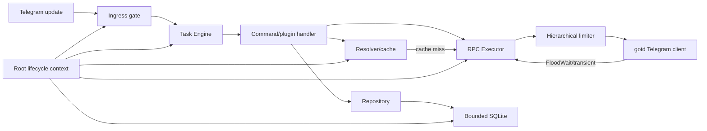

# Performa dan ketahanan Ultroid-Go

Tanggal analisa: 17 September 2026. Baseline: branch `test-next`, commit `691f19e`.

Status dokumen: pembahasan teknis, analisa source, dan rencana implementasi. Dokumen ini tidak menyatakan bahwa seluruh proposal sudah diterapkan.

Spesifikasi preskriptif untuk coding agent: [Spesifikasi teknis implementasi performa dan ketahanan](performance-resilience-implementation-spec.md).

## 1. Tujuan dan ruang lingkup

Dokumen ini membahas dua sasaran yang saling berkaitan:

1. **Performa**: mengurangi request Telegram, alokasi, goroutine liar, blocking I/O, dan query database berulang.
2. **Ketahanan**: menerapkan timeout, cancellation, retry terukur, FloodWait handling, rate limiting, graceful shutdown, dan recovery dari panic secara konsisten.

Performa tidak boleh dicapai dengan menghilangkan durability atau validasi. Ketahanan juga tidak boleh dicapai dengan retry tanpa batas, antrean tanpa batas, atau goroutine tambahan untuk setiap masalah. Target akhirnya adalah sistem yang bounded, observable, cancellable, dan dapat diprediksi ketika Telegram, SQLite, jaringan, atau plugin melambat.

Di luar cakupan dokumen ini:

- penggantian library `gotd/td`;
- distributed worker atau database eksternal;
- rewrite seluruh plugin;
- klaim angka peningkatan sebelum benchmark dan profiling dilakukan.

## 2. Ringkasan eksekutif

Baseline bukan aplikasi yang dimulai dari nol. Ia sudah memiliki Task Engine bounded, resource capacity, peer persistence, settings cache, rate limiter, RPC classification, lifecycle DAG, shutdown bertahap, serta recovery panic pada beberapa jalur. Upgrade harus menyatukan dan melengkapi fondasi tersebut.

Prioritas tertinggi adalah:

| Prioritas | Perubahan | Alasan |
|---|---|---|
| P0 | Satukan seluruh outbound Telegram melalui satu `RPCExecutor` | Retry, FloodWait, timeout, rate limit, metrik, dan invalidasi peer saat ini belum konsisten |
| P0 | Tetapkan deadline per kelas operasi dan pertahankan parent cancellation | Mencegah worker dan shutdown tertahan oleh RPC/DB/I/O yang tidak bounded |
| P0 | Tambahkan panic boundary pada plugin scope dan long-lived worker | Panic di luar Task Engine masih dapat menjatuhkan proses |
| P0 | Audit dan hilangkan `context.Background()` dari jalur request/runtime | Operasi anak harus berhenti bersama command, plugin, atau aplikasi |
| P1 | Ubah resolver menjadi cache-first dengan negative cache dan singleflight | Mengurangi request `contacts.resolveUsername` dan stampede |
| P1 | Batasi, batch, dan ukur write SQLite | SQLite tetap single-writer walaupun connection pool besar |
| P1 | Satukan limiter command dan outbound RPC secara hierarkis | Admission lokal saja tidak melindungi kuota Telegram |
| P1 | Lengkapi graceful shutdown dengan budget per fase | Shutdown sekarang bertahap, tetapi beberapa cleanup masih detached atau memakai background context |
| P2 | Kurangi alokasi pada hot path berdasarkan profil | Optimasi harus mengikuti `pprof`/benchmark, bukan tebakan |

## 3. Baseline yang telah ada

Mekanisme berikut sudah benar secara arah dan harus dipertahankan:

- `internal/taskengine` memiliki pool, backlog, payload budget, queue deadline, execution timeout, cancellation, terminal outcome, serta recovery panic handler.
- `internal/plugin.Scope` melacak goroutine/resource dan memberi budget maksimal per scope.
- dispatcher membatch persistence peer hingga 50 entitas dengan pending limit 4096.
- SQLite menggunakan WAL, `busy_timeout`, foreign keys, dan `synchronous=NORMAL`.
- resolver menyimpan access hash dan metadata peer di SQLite.
- settings memiliki cache serta invalidasi berbasis event/outbox.
- `internal/telegram/rpc_policy.go` sudah mengklasifikasikan transient error, FloodWait, stale peer, permission, auth, dan invalid request.
- aplikasi melakukan quiesce ingress, drain Runtime, baru menghentikan transport Telegram.
- Task Engine, EventBus, scheduler, jobs, media, dan process runner sudah mempunyai diagnostics atau accounting dasar.

Implementasi baru tidak boleh membuat executor, retry loop, atau lifecycle kedua yang bersaing dengan mekanisme tersebut.

## 4. Model target



Aturan target:

- satu accepted work mempunyai owner, queue deadline, execution deadline, dan terminal result;
- tidak ada retry yang melewati deadline caller;
- setiap goroutine mempunyai owner, cancel function, batas jumlah, dan join saat shutdown;
- setiap outbound Telegram request melewati policy yang sama;
- cache hanya mengurangi I/O, bukan menjadi sumber kebenaran yang tidak dapat diinvalidate;
- query dan RPC di hot path dapat dihitung dan dilacak latensinya;
- overload ditolak atau ditunda secara eksplisit, bukan diserap oleh antrean/goroutine tak terbatas.

## 5. Analisa performa

### 5.1 Mengurangi request Telegram

#### Kondisi saat ini

`internal/telegram/resolver.go` melakukan resolusi username ke Telegram lebih dahulu, kemudian baru mencoba storage lokal. Ini baik untuk menyegarkan access hash, tetapi membuat referensi username berulang tetap memanggil `contacts.resolveUsername`. Resolusi ID sudah menggunakan peer manager/storage, sedangkan jalur username belum benar-benar cache-first.

`internal/telegram/service.go` memiliki `retryOnFloodWait`, sementara resolver memakai `RetryRPC`. Dua jalur ini dapat menghasilkan jumlah attempt dan perilaku FloodWait yang berbeda. Request service yang tidak dibungkus kedua helper juga berpotensi mempunyai policy lain.

#### Desain target

Gunakan tiga lapis resolusi:

1. cache memori ber-TTL;
2. persistent peer storage;
3. Telegram RPC hanya pada miss, stale entry, atau forced refresh.

Tambahkan:

- `singleflight` per normalized reference agar burst untuk username yang sama hanya menghasilkan satu RPC;
- negative cache pendek, misalnya 15–30 detik, untuk username yang benar-benar tidak ditemukan;
- TTL berbeda: ID/access hash lebih panjang daripada username mapping;
- invalidasi segera saat `PEER_ID_INVALID`, `USER_ID_INVALID`, atau `CHANNEL_INVALID`;
- satu forced refresh maksimal sebelum operasi dinyatakan gagal;
- dedup request berdasarkan operation key hanya untuk operasi read-only.

Jangan dedup operasi mutasi seperti send, delete, ban, atau edit tanpa idempotency key yang kuat.

#### Kontrak yang disarankan

```go
type ResolveOptions struct {
    ForceRefresh bool
    MaxAge       time.Duration
}

type PeerResolver interface {
    Resolve(context.Context, string, ResolveOptions) (tg.InputPeerClass, error)
    Invalidate(context.Context, tg.InputPeerClass) error
}
```

#### Target pengukuran

- `telegram_peer_cache_hit_total{layer="memory|sqlite"}`;
- `telegram_peer_cache_miss_total`;
- `telegram_resolve_rpc_total`;
- rasio cache hit pada steady state;
- request Telegram per command dan per jenis operasi.

### 5.2 Mengurangi alokasi

Optimasi alokasi dilakukan setelah profil CPU/heap menunjukkan hotspot. Kandidat yang terlihat dari source:

- snapshot map/slice pada peer batching, EventBus, diagnostics, dan registries;
- pembuatan map/string berulang untuk metadata, cache key, logging, dan error;
- buffer media dan output command yang dapat menahan backing array besar;
- `time.After` pada loop retry, yang selalu membuat timer baru;
- salinan payload/result yang disimpan pada terminal retention.

Implementasi yang disarankan:

- preallocate slice dengan kapasitas yang diketahui;
- gunakan `time.NewTimer` dan `Stop` pada operasi cancellable;
- jangan memakai `sync.Pool` untuk object kecil sebelum benchmark menunjukkan manfaat;
- batasi byte, bukan hanya jumlah item, untuk payload, output, dan cache;
- stream file/media dan hindari `io.ReadAll` untuk input yang ukurannya tidak kecil;
- gunakan structured fields yang stabil; jangan membentuk stack/error string jika log level tidak memerlukannya;
- simpan value ringkas pada cache, bukan object Telegram lengkap jika hanya ID/access hash yang diperlukan.

Benchmark minimal:

```text
BenchmarkDispatcherIngress
BenchmarkResolverMemoryHit
BenchmarkResolverSQLiteHit
BenchmarkResolverTelegramMiss
BenchmarkTaskSubmitComplete
BenchmarkPeerBatchFlush
BenchmarkSettingsResolveHit
```

Setiap benchmark melaporkan `ns/op`, `B/op`, dan `allocs/op` dengan `go test -bench . -benchmem`.

### 5.3 Mencegah goroutine liar

#### Kondisi saat ini

Task Engine dan plugin scope sudah membatasi concurrency. Namun masih ada direct goroutine untuk lifecycle, watcher, cleanup, delayed delete, queue/player, userlog, serta background service. Direct goroutine tidak selalu salah; transport loop dan supervisor memang long-lived. Masalahnya adalah goroutine tanpa owner, cancel, join, panic boundary, atau budget.

`Scope.Go` membatasi maksimal 64 goroutine dan menunggu saat `Close`, tetapi callback `fn` belum memiliki `recover`. Panic di sana tidak berubah menjadi diagnostic failure.

Beberapa fungsi membuat goroutine waiter untuk `WaitGroup`. Pola ini aman jika dibuat sekali per lifecycle, tetapi berbahaya jika dibuat pada setiap pemanggilan `Stop(ctx)` yang timeout.

#### Klasifikasi wajib

| Jenis pekerjaan | Jalur eksekusi |
|---|---|
| Command, callback, inline, periodic attempt | Task Engine |
| Retry yang dapat ditunda | Scheduler/Job occurrence baru |
| Transport, outbox worker, watcher | Lifecycle-owned supervisor |
| Cleanup singkat | Scope cleanup dengan deadline |
| Fire-and-forget | Tidak diperbolehkan tanpa owner dan terminal accounting |

#### Implementasi panic-safe supervisor

```go
type Supervisor interface {
    Go(name string, fn func(context.Context) error) error
    Stop(context.Context) error
    Snapshot() []WorkerState
}
```

Supervisor harus:

- mempunyai limit worker;
- mewariskan root context;
- memulihkan panic dan mencatat stack;
- mendukung kebijakan `NeverRestart`, `RestartTransient`, atau `AlwaysRestart` dengan budget;
- memakai exponential backoff plus jitter untuk restart;
- membuka circuit setelah restart berulang;
- join semua worker pada shutdown.

`Scope.Go` dapat tetap dipertahankan sebagai façade plugin, tetapi implementasinya perlu memakai supervisor atau setidaknya panic boundary yang sama.

### 5.4 Menghindari blocking I/O

Blocking I/O tidak berarti seluruh operasi harus dipindahkan ke goroutine. Dalam Go, network dan database calls memang menunggu, tetapi harus cancellable, bounded, dan tidak dilakukan sambil memegang lock atau slot yang salah.

Aturan implementasi:

- semua network, subprocess, file, dan DB API menerima `context.Context`;
- jangan gunakan `context.Background()` di jalur command untuk menyimpan data, menghapus pesan, atau audit;
- jangan memegang mutex ketika memanggil Telegram, SQLite, filesystem, logger sync, callback user, atau menunggu channel;
- proses eksternal menggunakan `exec.CommandContext` dan batas output;
- media besar menggunakan streaming serta resource permit sebelum work masuk worker;
- retry delay panjang tidak tidur di worker; ubah menjadi deferred scheduled attempt;
- gunakan pool khusus bagi operasi blocking jika resource itu berbeda dari command concurrency.

Deadline awal yang direkomendasikan:

| Operasi | Default | Catatan |
|---|---:|---|
| SQLite point read | 500 ms | Local disk; ukur p99 sebelum menaikkan |
| SQLite write/transaksi kecil | 2 s | Termasuk busy wait, tetap di bawah shutdown budget |
| Telegram read RPC | 10 s | Dibungkus caller deadline jika lebih pendek |
| Telegram mutation RPC | 15 s | Retry hanya jika aman |
| HTTP metadata | 10 s | Body dibatasi |
| Download/media | Berdasarkan ukuran, maksimum terkonfigurasi | Tetap cancellable |
| Process probe | 5–15 s | Process harus dibunuh saat cancel |
| Plugin cleanup | 2 s per plugin, dengan global cap | Cleanup berikutnya tetap dijalankan |

Angka ini merupakan baseline konfigurasi, bukan konstanta abadi.

### 5.5 Mengurangi query database berulang

#### Kondisi saat ini

- settings sudah mempunyai cache dan event-driven invalidation;
- peer persistence sudah melakukan batch write;
- sebagian service/plugin masih melakukan read-modify-write atau beberapa query untuk satu event;
- `pmpermit` menggunakan `context.Background()` untuk mengambil/menyimpan daftar warning message pada hot path;
- SQLite file mode membuka banyak connection berdasarkan CPU, padahal writer tetap terserialisasi.

#### Implementasi

1. Instrumen query per repository dan latensi, tanpa membocorkan parameter sensitif.
2. Tetapkan query budget per command pada test integrasi untuk jalur kritis.
3. Gunakan cache read-through hanya untuk data dengan invalidasi yang jelas.
4. Batch peer, log, history, dan maintenance writes dengan batas jumlah **dan waktu**.
5. Gabungkan operasi yang harus atomik dalam satu transaksi, bukan beberapa round trip.
6. Hindari N+1; sediakan `GetMany`, `ListByIDs`, atau join yang sesuai.
7. Tambahkan indeks berdasarkan `EXPLAIN QUERY PLAN` dan query produksi, bukan tebakan.
8. Ukur contention sebelum menaikkan `MaxOpenConns`; lebih banyak connection tidak menambah writer SQLite.

Cache harus mempunyai:

- maximum entries/bytes;
- TTL;
- invalidation setelah commit;
- singleflight pada miss;
- metrik hit/miss/eviction;
- larangan cache untuk authorization state tanpa invalidasi kuat.

## 6. Analisa ketahanan

### 6.1 Timeout dan cancellation

Context ownership yang benar:

```text
OS signal / App.Run context
  -> runtime component context
    -> plugin scope / service context
      -> task context
        -> RPC, DB, HTTP, process, file operation
```

`context.Background()` hanya layak pada composition root atau cleanup yang sengaja harus hidup sedikit lebih lama dari caller dan tetap diberi timeout baru. Ia tidak boleh dipakai untuk “memastikan operasi selesai” tanpa batas.

Helper yang disarankan:

```go
func WithDefaultTimeout(parent context.Context, d time.Duration) (context.Context, context.CancelFunc) {
    if parent == nil {
        parent = context.Background()
    }
    if _, ok := parent.Deadline(); ok {
        return context.WithCancel(parent)
    }
    return context.WithTimeout(parent, d)
}
```

Dengan demikian deadline caller yang lebih ketat tidak diperpanjang.

Semua loop harus mempunyai `select` pada `ctx.Done()`. Setiap channel send yang bisa block juga harus mempunyai jalur cancel atau menggunakan bounded nonblocking admission sesuai semantics.

### 6.2 Retry terukur

Retry hanya dilakukan bila:

- error diklasifikasikan transient;
- operasi aman diulang atau mempunyai idempotency key;
- retry budget belum habis;
- context masih mempunyai cukup waktu;
- circuit breaker belum terbuka;
- rate limiter memberi permit.

Policy target:

```go
type RetryPolicy struct {
    MaxAttempts int
    BaseDelay   time.Duration
    MaxDelay    time.Duration
    MaxElapsed  time.Duration
    Jitter      float64
}
```

Gunakan full jitter agar banyak task tidak retry serentak. Pisahkan metrik initial request dari retry. Error akhir harus menyimpan class, attempt count, dan last delay.

Tidak boleh retry otomatis:

- permission/auth/invalid request;
- operasi mutasi yang outcome-nya ambiguous dan tidak punya idempotency protection;
- deadline/cancellation;
- FloodWait di atas batas inline wait.

### 6.3 FloodWait handling

Saat ini `retryOnFloodWait` menunggu hanya sampai lima detik dan mengulang sekali, sedangkan `RetryRPC` memakai policy lain. Keduanya harus diganti oleh satu executor.

Kebijakan target:

```text
FloodWait <= inline threshold dan deadline cukup
  -> tunggu secara cancellable, lalu retry dalam attempt budget

FloodWait > inline threshold dan pekerjaan durable/retriable
  -> hentikan attempt sekarang, jadwalkan ulang pada not-before

FloodWait > threshold dan pekerjaan interaktif/tidak durable
  -> kembalikan typed RateLimitError dengan RetryAfter
```

FloodWait juga harus memperbarui cooldown limiter untuk scope yang relevan—account/global, method, dan peer—agar request lain tidak langsung memperpanjang penalti.

Jangan memutus dan menyambung ulang seluruh Telegram client hanya karena FloodWait. FloodWait adalah server-side rate instruction, bukan bukti koneksi rusak.

### 6.4 Rate limiting

Command limiter saat ini melindungi abuse ingress. Assistant mempunyai limiter sendiri. Ini belum mengendalikan volume outbound RPC gabungan.

Gunakan limiter hierarkis:

- global per Telegram account;
- per RPC method/family;
- per peer/chat;
- per actor untuk command/assistant;
- per workload, misalnya broadcast.

Urutan outbound:

```text
context/deadline -> circuit state -> acquire limiter -> execute RPC
 -> classify -> update limiter/FloodWait state -> retry or return
```

Limiter harus bounded dalam jumlah key. Entry idle wajib dievict agar user/chat cardinality tidak menyebabkan memory leak.

Broadcast tidak boleh melakukan `sleep` di command worker untuk seluruh durasi. Jadikan target sebagai bounded task/occurrence dengan concurrency dan limiter khusus, sambil mempertahankan progress durable bila diperlukan.

### 6.5 Graceful shutdown

Urutan yang sudah ada—quiesce dispatcher, stop Runtime, lalu cancel transport—adalah dasar yang benar. Target lengkap:

1. **Quiesce ingress**: tolak update/command baru, hentikan claim scheduler dan addon admission.
2. **Drain**: selesaikan task accepted hingga deadline; transport/RPC dan DB masih hidup.
3. **Flush**: persistence pump, outbox, peer batch, metrics/log buffer.
4. **Stop services**: plugin scope, watcher, assistant, scheduler, EventBus.
5. **Stop transport**: cancel Telegram run dan join.
6. **Close infrastructure**: DB, file storage, process manager, logger.
7. **Force finalize**: task tersisa mendapat terminal outcome eksplisit.

Gunakan satu global shutdown deadline dan budget per fase. Jangan memberi setiap komponen timeout penuh secara berurutan karena total waktu dapat berlipat.

Contoh budget untuk global 30 detik:

| Fase | Budget maksimum |
|---|---:|
| Quiesce | 2 s |
| Drain task | 18 s |
| Flush persistence | 5 s |
| Stop transport/infrastructure | 4 s |
| Final accounting/log | 1 s |

Shutdown harus idempotent dan concurrent-safe. Pemanggil yang timeout hanya berhenti menunggu; ia tidak boleh memulai teardown kedua.

### 6.6 Recovery dari panic

Panic boundary diperlukan pada:

- Task Engine handler—sudah ada;
- EventBus subscriber—pertahankan dan ukur;
- callback/inline handler;
- plugin `Scope.Go`;
- supervisor worker dan persistence loop;
- cleanup callback—sudah direcover, tetapi error/panic perlu dicatat, bukan dibuang.

Recovery harus berada di batas framework, bukan di setiap fungsi domain.

```go
defer func() {
    if value := recover(); value != nil {
        err := PanicError{
            Component: name,
            Value:     value,
            Stack:     debug.Stack(),
        }
        metrics.RecordPanic(name)
        logger.Error("component panic", zap.Error(err))
        report(err)
    }
}()
```

Jangan melanjutkan object yang invariannya mungkin sudah rusak. Task diterminasi sebagai panic. Worker stateless boleh mengambil task berikutnya. Long-lived component hanya direstart jika policy menyatakan aman dan restart budget belum habis.

Panic akibat invariant core, corruption, atau auth/session fatal harus membuat health `unhealthy` dan memicu controlled shutdown, bukan restart loop.

## 7. `RPCExecutor` sebagai implementasi pusat

Komponen baru yang direkomendasikan:

```go
type OperationKind uint8

const (
    ReadOnly OperationKind = iota
    IdempotentMutation
    NonIdempotentMutation
)

type RPCRequest struct {
    Method string
    Peer   string
    Kind   OperationKind
    Policy RetryPolicy
}

type RPCExecutor interface {
    Do(context.Context, RPCRequest, func(context.Context) error) error
}
```

Tanggung jawab executor:

- default timeout tanpa memperpanjang deadline caller;
- global/method/peer rate limit;
- error classification;
- exponential backoff dengan jitter;
- FloodWait propagation atau deferred retry decision;
- stale peer callback/invalidation;
- circuit breaker untuk kegagalan transport berulang;
- metrics dan tracing;
- tidak melakukan logging payload sensitif.

`telegram.Service`, `Resolver`, assistant interaction, broadcast, userlog, dan scheduler action wajib menggunakannya. Hapus helper retry duplikat setelah migrasi selesai.

## 8. Observability dan acceptance criteria

### 8.1 Metrik minimum

| Area | Metrik |
|---|---|
| Telegram | request, error class, retry, FloodWait seconds, limiter wait/reject, latency |
| Resolver | memory/SQLite hit, miss, negative hit, singleflight shared, stale invalidation |
| Database | query count, latency, busy/locked, transaction rollback, batch size |
| Task Engine | admitted, rejected, queue depth/wait, running, timeout, cancel, panic |
| Goroutine | runtime count, supervisor count, per-plugin active/limit, leaked on shutdown |
| Cache | entries, bytes, hit/miss, eviction |
| Shutdown | duration per phase, forced finalization, component timeout |

Label tidak boleh memakai raw user ID, chat ID, username, task ID, atau error message karena cardinality dan privasi. Gunakan component, method family, outcome, dan error class.

### 8.2 SLO awal

SLO berikut adalah target awal yang harus divalidasi dengan workload nyata:

- tidak ada pertumbuhan goroutine/heap monoton setelah workload berhenti;
- idle state tidak melakukan polling/query berfrekuensi tinggi;
- 100% operasi eksternal hot path mempunyai context dan deadline;
- command yang dibatalkan tidak terus melakukan Telegram/DB side effect baru;
- tidak ada retry untuk permanent error;
- tidak ada retry yang melewati parent deadline;
- shutdown normal selesai dalam global budget dan meninggalkan nol plugin resource leak;
- burst username identik menghasilkan paling banyak satu Telegram resolve aktif;
- query count per command kritis tidak naik tanpa perubahan acceptance test;
- race suite dan architecture tests tetap lulus.

## 9. Rencana implementasi

### Fase 0 — Baseline dan guardrail

Deliverable:

- benchmark untuk dispatcher, resolver, Task Engine, peer batch, dan settings;
- load harness menggunakan fake Telegram RPC dan temporary SQLite;
- goroutine/heap profile idle, steady, burst, cancellation, dan shutdown;
- inventory seluruh direct goroutine, `context.Background`, `time.After`, Telegram RPC, dan query;
- regression test untuk request/query count.

Tidak ada optimasi besar sebelum baseline tersimpan.

### Fase 1 — Context, timeout, dan panic boundary

1. Tambahkan helper deadline terpusat.
2. Teruskan command/task context ke `pmpermit`, delayed delete, audit, peer storage, dan plugin/service hot path.
3. Ganti background context pada runtime operation dengan owner context.
4. Tambahkan recovery dan diagnostic report pada `Scope.Go`, supervisor, serta cleanup.
5. Pastikan subprocess dan HTTP client memakai context.
6. Tambahkan test cancellation dan goroutine leak.

Acceptance:

- cancellation menghentikan fake blocked RPC/DB/process;
- panic plugin tidak menjatuhkan proses dan menghasilkan terminal diagnostic;
- `go test -race ./...` lulus.

### Fase 2 — RPCExecutor dan FloodWait

1. Implementasikan executor dengan injected clock/sleeper untuk deterministic test.
2. Migrasikan resolver dan operasi service read-only.
3. Migrasikan mutation satu per satu berdasarkan idempotency class.
4. Integrasikan limiter dan metrics.
5. Tambahkan deferred retry untuk durable jobs saat FloodWait panjang.
6. Hapus `retryOnFloodWait` dan pemanggilan `RetryRPC` langsung setelah semua call site berpindah.

Acceptance:

- table-driven test untuk semua error class;
- jitter/backoff tidak melewati `MaxElapsed` atau deadline;
- FloodWait pendek cancellable;
- FloodWait panjang tidak menahan physical worker;
- mutation non-idempotent tidak diulang saat hasil ambiguous.

### Fase 3 — Cache dan pengurangan I/O

1. Tambahkan memory cache bounded dan singleflight pada resolver.
2. Jadikan persistent lookup jalur sebelum Telegram RPC.
3. Terapkan stale invalidation dan one-shot refresh.
4. Audit N+1 repository dan tambahkan batch API.
5. Tambahkan query instrumentation serta `EXPLAIN QUERY PLAN` test untuk query kritis.
6. Tune SQLite pool berdasarkan benchmark concurrent reader/writer.

Acceptance:

- steady repeated resolve tidak memanggil Telegram;
- cache stampede test lulus;
- cache size tetap bounded;
- stale access hash dipulihkan tanpa retry loop;
- query budget test stabil.

### Fase 4 — Goroutine supervision dan shutdown budget

1. Introduce lifecycle supervisor untuk long-lived worker.
2. Migrasikan loop/watcher direct goroutine yang bukan Task Engine.
3. Tambahkan restart policy dan circuit breaker hanya pada komponen yang aman.
4. Terapkan global shutdown budget dan phase accounting.
5. Flush peer batch/outbox/persistence sebelum transport dan DB ditutup.

Acceptance:

- repeated start/stop tidak menambah goroutine;
- shutdown ketika RPC, DB, dan plugin macet tetap selesai dalam budget;
- seluruh accepted task mempunyai terminal result;
- tidak ada waiter goroutine yang tertinggal setelah caller timeout.

### Fase 5 — Optimasi alokasi berbasis profil

1. Bandingkan CPU/heap profile dengan Fase 0.
2. Optimalkan tiga hotspot terbesar saja.
3. Tambahkan benchmark regression threshold yang tidak flaky.
4. Ulangi soak test, race test, dan failure injection.

## 10. Strategi pengujian

### Unit test

- retry classification, backoff, jitter, deadline, dan idempotency;
- cache TTL, invalidation, eviction, negative cache, singleflight;
- limiter hierarchy dan cardinality cleanup;
- panic conversion dan supervisor restart budget;
- shutdown state transition serta idempotency.

### Integration test

- fake Telegram mengembalikan FloodWait, transient error, permanent error, dan ambiguous mutation;
- SQLite lock contention, slow query, rollback, dan cancellation;
- command cancel saat resolve/download/process;
- plugin disable ketika task dan goroutine masih berjalan;
- SIGTERM saat backlog penuh dan outbox belum kosong.

### Soak dan failure injection

- update burst selama 30–60 menit;
- peer cardinality tinggi;
- database intermittent busy;
- network timeout dan reconnect;
- panic acak pada plugin handler;
- shutdown berulang pada setiap lifecycle phase.

Perintah verifikasi minimum:

```bash
go test -race ./...
go vet ./...
go test -run '^$' -bench . -benchmem ./internal/telegram ./internal/taskengine ./internal/settings
golangci-lint run --timeout=3m
go build -v ./cmd/goultroid
```

Untuk leak test, bandingkan goroutine profile setelah warm-up dan setelah seluruh work selesai; jangan mengandalkan `runtime.NumGoroutine` saja karena jumlah yang sama dapat menyembunyikan goroutine berbeda yang bocor.

## 11. Risiko migrasi

| Risiko | Mitigasi |
|---|---|
| Cache-first memakai peer stale | Invalidasi typed error dan forced refresh satu kali |
| Retry menggandakan mutation | Klasifikasi idempotency dan idempotency key |
| Rate limiter menurunkan responsivitas | Pisahkan workload class, ukur wait/reject, konfigurasi bertahap |
| Timeout terlalu agresif | Mulai dari observasi p95/p99 dan konfigurasi per operasi |
| Batching kehilangan write saat crash | Flush bounded + durable outbox untuk data penting |
| Supervisor menyembunyikan bug | Panic tetap dicatat; restart dibatasi; invariant fatal mematikan component |
| Cache/metrics menambah memory | Batas entries/bytes dan label rendah cardinality |
| Shutdown global deadline memotong flush | Reserve finalization budget dan terminal outcome eksplisit |

## 12. Definition of done

Pekerjaan ini selesai jika:

- seluruh outbound Telegram memakai satu policy executor;
- request, retry, FloodWait, dan cache behavior dapat diobservasi;
- seluruh runtime I/O penting cancellable dan mempunyai deadline;
- semua goroutine mempunyai owner, limit, cancel, panic boundary, dan join;
- cache/query optimization dibuktikan benchmark atau query-count test;
- shutdown bertahap selesai dalam budget dan aman dipanggil berulang;
- tidak ada retry permanen, retry tak terbatas, atau long sleep di physical worker;
- failure injection untuk Telegram, SQLite, process, plugin panic, dan shutdown lulus;
- `go test -race ./...`, `go vet ./...`, lint, dan production build lulus;
- perubahan performa dilaporkan dengan baseline, workload, environment, serta before/after—bukan klaim tanpa data.

## 13. File yang menjadi titik implementasi utama

| Area | File/package awal |
|---|---|
| RPC policy/executor | `internal/telegram/rpc_policy.go`, `internal/telegram/service.go` |
| Peer resolution/cache | `internal/telegram/resolver.go`, `peer_storage.go`, `dispatcher_peer.go` |
| Task timeout/panic/result | `internal/taskengine`, `internal/tasks` |
| Plugin goroutine | `internal/plugin/scope.go`, `manager.go` |
| Rate limiting | `internal/services/ratelimit`, `internal/app/rate_limiter.go` |
| SQLite/persistence | `internal/database`, feature repositories, jobs/scheduler stores |
| Lifecycle/shutdown | `internal/runtime`, `internal/app/lifecycle.go`, `shutdown.go` |
| Metrics/diagnostics | `internal/core/metrics.go`, `internal/app/diagnostics.go` |
| Blocking process/media | `internal/platform/process`, `internal/services/process`, `media`, `download` |

Setiap fase sebaiknya menghasilkan commit kecil yang dapat di-review dan di-rollback. Jangan menggabungkan migrasi RPC, perubahan database, dan redesign shutdown dalam satu patch besar.
